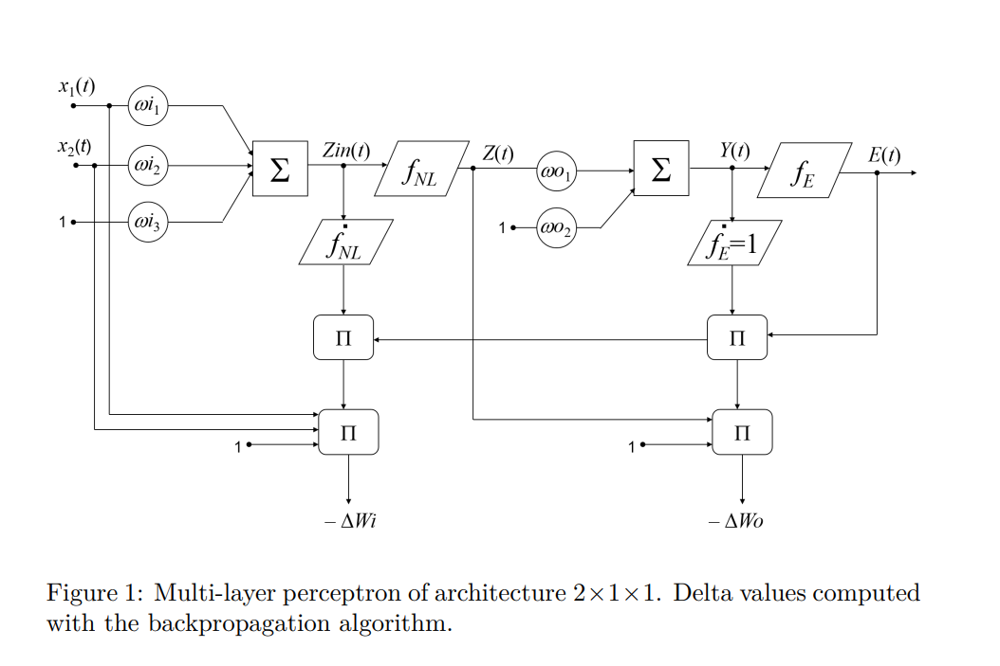
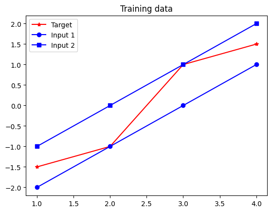
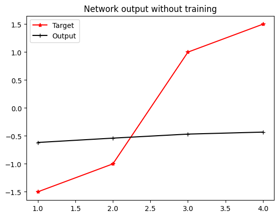
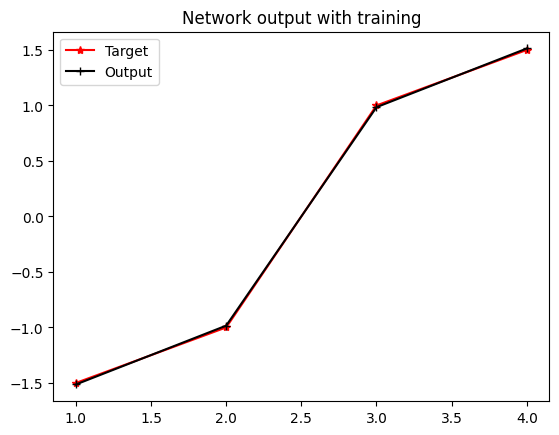

$$
Y(t) = W_o^T f_{NL}(W_i^T X(t) + b_i) + b_o
$$


$$ E(t) = Y(t) - T(t) $$

$$ \text{mse} = \frac{1}{s} \sum_{k=1}^{m} \sum_{t=1}^{s} e_k^2(t) $$

$$ \Delta W_o = -\alpha \cdot \frac{2}{s} \cdot E(t) \cdot Z^T(t) $$

$$ \Delta W_i^T = -\alpha \cdot \frac{2}{s} \cdot E^T(t) \cdot W_{oj} \cdot \frac{\partial f_{NL}}{\partial Z_{in}} \cdot X^T(t) $$





# Building A Feedforward Neural Network

The goal of this exercise is to build a simple **[Feedforward Neural Network](https://en.wikipedia.org/wiki/Feedforward_neural_network)** in Python from scratch, without relying on existing frameworks like Keras or TensorFlow to gain a better understanding of the underlying mechanism of neural networks. This involves manually implementing forward propagation, activation functions, loss calculations, and backpropagation for weight updates.

## Theoretical Background

 A **Feedforward Neural Network (FNN)** consists of layers of neurons, with each layer fully connected to the next one. Unlike other networks, FNNs do not have cycles or loops, and information flows only in one direction: from input to output. The simplest architecture consists of:

- **Input Layer**: Receives the input features.
- **Hidden Layer(s)**: Processes inputs from the input layer.
- **Output Layer**: Produces the final prediction.

Mathematically, a simple feedforward network with \( n \) inputs, \( m \) outputs, and a hidden layer with \( p \) neurons can be modeled as:

$$
Y(t) = W_o^T f_{NL}(W_i^T X(t) + b_i) + b_o
$$

Where:

- \( X(t) \) is the input vector for the \( t \)-th sample.
- \( W_i , W_o \) is the weight matrix for the input and output layers.
- \( b_i , b_o \) is the bias vector for the hidden and output layers.
- \( f_{NL} \) is the non-linear activation function (e.g., Tanh, ReLU)
- \( Y(t) \) is the predicted output vector for the \( t \)-th sample.


The network learns by adjusting these weights and biases based on the error between the predicted output  \( Y(t) \)  and the actual target \( T(t) \):

$$ E(t) = Y(t) - T(t) $$

The goal is to minimize this error across all samples by optimizing the weights and biases.


<details open>
  <summary>What is <b>Mean Squared Error (MSE)</b>?</summary>
  
  The Mean Squared Error (MSE) is a common metric for measuring how well a model fits the data. It calculates the average squared difference between the predicted and actual values. It aggregates the errors across all samples to provide a single measure of the network's performance.

  It is the average of the squared differences between the predicted values and the actual target values. As the error rate increases, the MSE penalty grows quadratically, which heavily penalizes larger errors. A downside to MSE is that if applied to a dataset with a few outliers, it can heavily penalize the model.

  $$ 
  \text{MSE} = \frac{1}{s} \sum_{t=1}^{s} \sum_{k=1}^{m} (y_k(t) - \hat{y}_k(t))^2 = \frac{1}{s} \sum_{t=1}^{s} \| \mathbf{E}(t) \|^2 
  $$

  <li>
  \( s \) is the total number of samples.
  </li>
  <li>
  \( m \) is the number of output neurons or dimensions.
  </li>
  <li>
  \( y_k(t) \) is the observed (actual) value for the \( k \)-th output in the \( t \)-th sample.
  </li>
  <li>
  \( \hat{y}_k(t) \) is the predicted value for the \( k \)-th output in the \( t \)-th sample.
  </li>
  <li>
  \( \mathbf{E}(t) \) is the error vector for the \( t \)-th sample, where each component \( e_k(t) = y_k(t) - \hat{y}_k(t) \).
  </li>

  MSE is one of the most popular tools to measure how accurate models are within statistics and machine learning. Within ML, MSE is used as a loss function or part of a loss function that an algorithm minimizes.
  
</details>

When training a neural network, our goal is to **minimize the MSE**, meaning we want our predictions to be as close as possible to the actual targets.

### Backpropagation

To minimize the MSE, we need to adjust the network's weights in the direction that reduces the error. This is achieved through **backpropagation**, which involves computing the gradient of the MSE with respect to each weight in the network.


Backpropagation can be done by following the four steps:

**1. Compute the gradient of MSE**
The gradient of the MSE with respect to each weight in the output layer \( W_o \) is calculated to understand how changes in these weights affect the overall error. The formula for the gradient is:

   $$
   \frac{\partial \text{MSE}}{\partial W_o} = \frac{2}{s} E(t) \cdot Z^T(t)
   $$

Where:

  - \( \frac{2}{s} \): This scaling factor comes from the derivative of the squared error term and the averaging over all samples in the MSE.
  - \( E(t) \): The error vector for the \( t \)-th sample (\( E(t) = Y(t) - T(t) \)).
  - \( Z(t) \) is the output of the hidden layer. The superscript \( T \) to \( Z^T\) denotes the 'transpose' of \( Z(t) \), and it ensures that the dimensions of the vectors or matrices involved in the multiplication are compatible. If \( Z(t) \) is a column vector, its transpose \( Z^T(t)\) becomes a row vector (or vice versa), allowing for correct multiplication with the error vector.


**2. Update the Output Layer Weights (\( W_o \))**
Using the computed gradients, we update the weights for the output layer:

   $$
   \Delta W_o = -\alpha \cdot \frac{2}{s} E(t) \cdot Z^T(t)
   $$
   Here, \( \alpha \) is the learning rate, controlling the step size of each update.

**3. Compute the Gradient of MSE with Respect to Input Layer Weights (\( W_i \)):**

   We then compute the gradients for the input layer weights, considering the backpropagated error from the output layer:

   $$
   \Delta W_i^T = -\alpha \cdot \frac{2}{s} E^T(t) \cdot W_o \cdot \frac{\partial f_{NL}}{\partial Z_{in}} \cdot X^T(t)
   $$

Here, \( \frac{\partial f_{NL}}{\partial Z_{in}} \) is the derivative of the non-linear activation function with respect to the input of the hidden layer, and \( X^T(t) \) is the transpose of the input vector for the \( t \)-th sample.

**4. Update the Input Layer Weights (\( W_i \)):**

Finally, the input layer weights are updated*:

$$
W_i = W_i + \Delta W_i
$$
*(For clarity, the equal sign = here is for assignment)

This process repeats for multiple epochs until the network converges to a state where the error is minimized.   

The non-linear function we will use in this exercise is the hyperbolic tangent "Tanh":

$$ f_{NL}(x) = \frac{2}{1+e^{-2x}}-1 $$


Now that we’ve explored the mathematical foundations, let’s see how we can implement a feedforward neural network from scratch in Python. This will give us a deeper understanding of how the forward and backward passes work without the abstraction of higher-level libraries.


## Setup

##### Creating the Neural Network in Python

We'll start by implementing the feedforward neural network using **NumPy**, a fundamental package for scientific computing in Python.

Numpy is a popular choice in ML because (1) array is much more efficient than lists, and (2) we can easily define the activation function such as tanh(x) with the library.

```Python
import numpy as np
```
Let's define our input and target vectors:
```Python
import numpy as np

# Define input and target vectors
x = np.array([[-2, -1, 0, 1],  # input 1
              [-1,  0, 1, 2]]) # input 2

t = np.array([-1.5, -1, 1, 1.5]) # target

# Display the inputs and corresponding targets
print(f"This network has {x.shape[1]} inputs:")

for i in range(x.shape[1]):
    print(f"    [{x[0, i]}, {x[1, i]}] with target {t[i]}")
```

Output:
```Python
This network has 4 inputs:
    [-2, -1] with target -1.5
    [-1, 0] with target -1.0
    [0, 1] with target 1.0
    [1, 2] with target 1.5
```

Next, we'll initialize the network parameters. Feel free to try varying these values to test the influence in the algorithm.

```Python
wi1=0.0651    # first weight of the input layer
wi2=-0.6970   # second weight of the input layer
wo=-0.1342    # first weight of the output layer
bi=0          # input bias
bo=-0.5481    # output bias

q=500         # training epochs
a=0.01        # learning rate
```

It is always a good practice to visualize the data distribution by plotting the input values against the targets. If certain inputs are grouped closely and share similar characteristics, it might indicate redundancy in data. It also helps us eliminate any outliers we don't want to include in our training.

To plot the input and target vectors, we will use [Matplotlib](https://matplotlib.org/stable/tutorials/pyplot.html):

```py
import matplotlib.pyplot as plt
```

```py
i=np.arange(1,s+1)   # x axis for plotting (1 to 4)
# Refer to matplotlib doc for plt functions: https://matplotlib.org/stable/tutorials/pyplot.html

plt.plot(i, t, 'r*-', label='Target') # red star marker solid line (r*-)
plt.plot(i,x[0],'bo-',label='Input 1') # blue circle marker solid line (bo-)
plt.plot(i,x[1],'bs-',label='Input 2') # blue square marker solid line (bs-)
plt.title('Training data')
plt.legend()
plt.show()
```


## Experiments

Now it's time to propagate the inputs through the network.


$$
Y(t) = W_o^T f_{NL}(W_i^T X(t) + b_i) + b_o
$$

First, we'll pass input data through each layer of the network, applying weights and bias at each neuron. 


Recap of the concept of FNN:
> 


```py
# initialize temp variables for forward propagation
s = x.shape[1]     # number of samples (data points, 4 here)
zini = np.zeros(s) # zin for each data point
zi = np.zeros(s)   # zi for each data point
yi = np.zeros(s)   # output without training

# forward propagation
for k in range(s):
  x0_k = x[0, k]   # kth data point of 1st input
  x1_k = x[1, k]   # kth data point of 2nd input  
  zini[k] = (wi1 * x0_k + wi2 * x1_k) + bi
```


Then, we'll transform the data using the activation function *tanh* and apply the output weight and bias to optain the final output.


```py
# forward propagation
for k in range(s):
  x0_k = x[0, k]   # kth data point of 1st input
  x1_k = x[1, k]   # kth data point of 2nd input
  zini[k] = (wi1 * x0_k + wi2 * x1_k) + bi
  zi[k] = (2/(1+np.exp(-2*zini[k])))-1
  yi[k] = zi[k] * wo + bo
```

Now we can plot this output using `plt.plot` as before:
```py
plt.plot(i,t,'r*-',label='Target')
plt.plot(i,yi,'k+-',label='Output')
plt.title('Network output without training')
plt.legend()
plt.show()
```



 As you can see, the output prediction of our untrained neural network (black line) deviates from the target vector (red). 
 
### Training the neural network

 For a better result, we'll start training the network for 500 epochs with 0.01 learning rate and monitor the MSE (Mean Squared Error) over time.

 $$ E(t) = Y(t) - T(t) $$

$$ \text{mse} = \frac{1}{s} \sum_{k=1}^{m} \sum_{t=1}^{s} e_k^2(t) $$

First, we'll initialize the variables for the MSE and errors:
```py
 mse = np.zeros(q) # MSE for each epoch
 e = np.zeros(q)   # Error for each epoch
```

The first part of the training will involve computing the output of the network, which we have done above already.
```py
for ep in range(q): # for each epoch 
  for k in range(s): # for every data point
    # 1. Compute the output of the network
    # 2. Compute the error
    # 3. Backpropagate
```

So we will simply copy and paste from above. (Note we should reset the variables at the start of each epoch)
```py
for ep in range(q): # for each epoch 
  zini = np.zeros(s) # zin for each data point
  zi = np.zeros(s)   # zi for each data point
  yi = np.zeros(s)   # output without training

  for k in range(s): # for every data point
    # 1. Compute the output of the network      
    zini[k] = (wi1 * x0_k + wi2 * x1_k) + bi
    zi[k] = (2/(1+np.exp(-2*zini[k])))-1
    yi[k] = zi[k] * wo + bo

    # 2. Compute the error
    # 3. Backpropagate
```
Then, we will set the error and the MSE. 

> The network computes the error between the predicted output \( Y(t) \) and the actual target \( T(t) \):
$$ E(t) = Y(t) - T(t) $$


```py
for ep in range(q): # for each epoch 
  zini = np.zeros(s) # zin for each data point
  zi = np.zeros(s)   # zi for each data point
  yi = np.zeros(s)   # output without training
  
  for k in range(s): # for every data point
    # 1. Compute the output of the network      
    zini[k] = (wi1 * x0_k + wi2 * x1_k) + bi
    zi[k] = (2/(1+np.exp(-2*zini[k])))-1
    yi[k] = zi[k] * wo + bo


    # 2. Compute the error
    e[k] = yi[k] - t[k]

    # 3. Backpropagate
```

And we'll follow the formula for MSE. 

> To optimize the network, we aim to minimize the **Mean Squared Error (MSE)**:
> $$ \text{mse} = \frac{1}{s} \sum_{k=1}^{m} \sum_{t=1}^{s} e_k^2(t) $$
> Where: 
> <li> \( s \) is the total number of samples, </li>
> <li> \( e_k(t) \) is the \( k \)-th component of the error vector \( E(t) \). </li>


```py
for ep in range(q): # for each epoch 
  zini = np.zeros(s) # zin for each data point
  zi = np.zeros(s)   # zi for each data point
  yi = np.zeros(s)   # output without training
  
  for k in range(s): # for every data point
    # 1. Compute the output of the network      
    zini[k] = (wi1 * x0_k + wi2 * x1_k) + bi
    zi[k] = (2/(1+np.exp(-2*zini[k])))-1
    yi[k] = zi[k] * wo + bo


    # 2. Compute the error
    e[k] = yi[k] - t[k]
    mse[ep] = mse[ep] + (1.0/s)*np.power(e[k],2)

    # 3. Backpropagate
```


And there's our MSE - we can plot this and see how the MSE changes over time already:

```py
# Plotting the mean squared error
plt.semilogy(range(q),mse,'b.', label='MSE')
plt.title('Mean squared error')
plt.xlabel('epochs')
plt.ylabel('performance')
plt.legend()
plt.show()
```

Let's do backpropagate our neural network and see how much better it can get. 

We'll start with the output layer:

  $$ \Delta W_o = -\alpha \cdot \frac{2}{s} \cdot E(t) \cdot Z^T(t) $$


- \( \alpha \) is the learning rate,
- \( Z(t) \) is the output of the hidden layer.
- The factor \( \frac{2}{s} \)​ is derived from the MSE function


 The key part of this stage is calculating the gradients of the error with respect to the weights and biases to adjust them. Specifically:

- The gradient \( ΔW_o \) is calculated for the weights and bias of the output layer using the error term \( e_k \) and the learning rate \( a \), and the hidden layer output \( z_k \).
- These gradients are accumulated across all data points to reflect how much each weight and bias contributed to the overall error.
- The calculated gradients will then be used to update the weights and biases, with the goal of reducing the error in the next epoch.


Back to our code, we will first initialize the variables. These will also need to be reset for every epoch along with other variables during training:
```py
for ep in range(q): # for each epoch 
  zini = np.zeros(s) # zin for each data point
  zi = np.zeros(s)   # zi for each data point
  yi = np.zeros(s)   # output without training
  dEdbo = dEdwo = 0 # delta variables for backpropagation
```

And to backpropagate, we will follow the formula for \( ΔW_o \) and update the deltaE for every data point. Here, Z(t) for the output bias is 1 and thus ommitted.
```py
for ep in range(q): # for each epoch 
...
  for k in range(s): # for every data point
    ...
    # 3. Backpropagate
        dEdbo=dEdbo+a*(2.0/s)*e[k] # delta E with respect to output bias ... Z(t) = 1 is ommitted for output bias
        dEdwo=dEdwo+a*(2.0/s)*e[k]*z[k] # delta E with respect to output weight ... Z(t) is z[k]
```

And for the input layer, it will be similar to the output layer except that it has a few more variables: the input bias, and the input weight for each input:

  $$ \Delta W_i^T = -\alpha \cdot \frac{2}{s} \cdot E^T(t) \cdot W_{oj} \cdot \frac{\partial f_{NL}}{\partial Z_{in}} \cdot X^T(t) $$


(Note 1: \( j \) is for indexing hidden neurons, but it can be ignored in our case since we only have two layers... i.e. input and output layer)

(Note 2: The derivative of the hyperbolic tangent, \( \frac{\partial f_{NL}}{\partial Z_{in}} \) needs to be simplified to an [alternative form](https://www.wolframalpha.com/input/?i=derivative+tanh%28x%29) to be written in Python )

For the non-linear function we will use the hyperbolic tangent:

$$ f_{NL}(x) = \frac{2}{1+e^{-2x}}-1 $$

```py
for ep in range(q): # for each epoch 
  ...
  for k in range(s): # for every data point
    ...
    # 3. Backpropagate
    # Computing delta values (gradients) for the output layer
    dEdbo=dEdbo+a*(2.0/s)*e[k]
    dEdwo=dEdwo+a*(2.0/s)*e[k]*z[k]

    # Computing delta values (gradients) for the hidden layer (using the derivative of the non-linear function)
    dEdbi=dEdbi+a*(2.0/s)*e[k]*wo*(4*np.exp(-2*zin[k])/np.power(1+np.exp(-2*zin[k]),2))
    dEdwi1=dEdwi1+a*(2.0/s)*e[k]*wo*(4*np.exp(-2*zin[k])/(np.power(1+np.exp(-2*zin[k]),2)))*x[0,k]
    dEdwi2=dEdwi2+a*(2.0/s)*e[k]*wo*(4*np.exp(-2*zin[k])/(np.power(1+np.exp(-2*zin[k]),2)))*x[1,k]
```

And that's it! The code for training the neural network is complete. Now we are ready to recalculate the network output with updated weights and biases, the same way we did the initial calculation: 

```py
# Recalculate the network output after training with updated weights and biases
for k in range(s):
    x0_k = x[0, k]   # kth data point of 1st input
    x1_k = x[1, k]   # kth data point of 2nd input
    zini[k] = (wi1 * x0_k + wi2 * x1_k) + bi
    zi[k] = (2/(1+np.exp(-2*zini[k])))-1 # activation function
    yi[k] = zi[k] * wo + bo # updated network output
```

If we plot the outputs and the target vector, we should be able to see the output matching with the target more closely than before.

```py
# Plotting network output after training
plt.plot(i,t,'r*-',label='Target')
plt.plot(i,yi,'k+-',label='Output after training')  # Now plotting the updated output
plt.title('Network output after training')
plt.legend()
plt.show()
```

Before:


After:




**Bonus Exercises**

- Try varying the number of epochs or the learning rate. How does it influence the training?

- Try varying the initial value of the weights to the following set: wi1 = 0, wi2 = 0, wo = 1, bi = 1, bo = 1. The training is highly dependent of the initial solution, why?


### Keras Implementation

There are libraries that abstracts away the process of creating and training neural networks, like TensorFlow and Keras. Here is an example implementation in Keras, which yields the same results as above: 

```py
import numpy as np
import matplotlib.pyplot as plt
from keras.models import Sequential
from keras.layers import Dense
from keras.optimizers import Adam
from keras.optimizers from SGD

# Inputs and targets
x = np.array([-2,-1,0,1],[-1,0,1,2]).transpose() # inputs
t = np.array([-1.5,-1,1,1.5]).transpose() # targets

# Create the neural network with TensorFlow
nnet = Sequential() # creates FNN
nnet.add(Dense(1, input_dim=2, activation='tanh'))
nnet.add(Dense(1, activation='linear'))

# Learning algorithm and learning rate
nnet.compile(loss='mean_squared_error', optimizer=SGD(learning_rate=0.01))

# Feedforward propagation, i.e. network output without training
ye = nnet.predict(x)

# Train the neural network
nnet.fit(np.array(x), np.array(t), batch_size=4, epochs = 500, verbose=0)

# Feedforward propagation, i.e. network output without training
ye = nnet.predict(x)
```


[Complete Code (Vanilla Python)](fnn-feedforward-neural-network.py)

[Complete Code (Keras)](fnn-feedforward-neural-network-keras.py)


#### Conclusion


 In this tutorial, we've built a simple Feedforward Neural Network from scratch. We've explored how forward propagation, backpropagation, and weight updates work in neural networks without relying on pre-built libraries.

Understanding the core principles behind neural networks is essential for deep learning. The skills learned here will not only help you understand what’s happening under the hood of frameworks like Keras or TensorFlow but also enable you to customize models for unique tasks or research problems.


---

Next Steps:

**Larger, real-world Datasets**: Explore more implementations on larger, real-world datasets to understand how the network scales.

**More Optimizers**: Learn about advanced optimizers like Adam or RMSProp, which offer better convergence in complex networks.

More to be covered in the upcoming exercises!