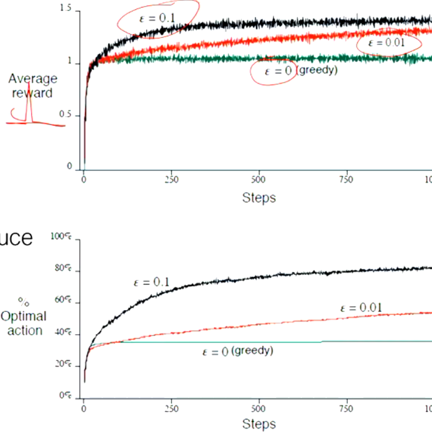
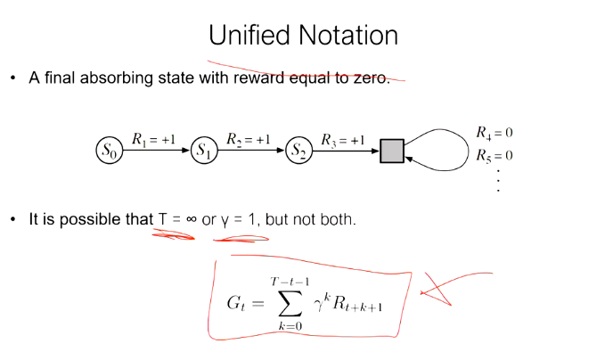

# Introduction to Artificial Intelligence


The content is inspired by my personal notes and learnings from the course [COMP9814: Extended Artificial Intelligence at UNSW (24T3)](https://www.unsw.edu.au/course-outlines/course-outline#year=2024&term=Term%203&deliveryMode=In%20Person&deliveryFormat=Standard&teachingPeriod=T3&deliveryLocation=Kensington&courseCode=COMP9814&activityGroupId=1). It assumes readers have a basic understanding of Python and mathematics at a sophomore university level, as well as a solid grasp of fundamental data structures and algorithms.

⚠️ Site is currently under active development, frequent changes are expected

## Resources

For a deeper understanding of the topics covered, the following textbooks are recommended:

* Poole, D.L. & Mackworth, A. [Artificial Intelligence: Foundations of Computational Agents](https://artint.info/3e/html/ArtInt3e.html). Second Edition. Cambridge University Press, Cambridge, 2017.
* Russell, S.J. & Norvig, P. **Artificial Intelligence: A Modern Approach**. Fourth Edition, Pearson Education, Hoboken, NJ, 2021.
* Sutton, R. & Barto, A. [Reinforcement Learning: An Introduction](http://incompleteideas.net/book/the-book-2nd.html). MIT press, 2018.
* Jurafsky, D. & Martin, J. H. [Speech and Language Processing](https://web.stanford.edu/~jurafsky/slp3/). Stanford, 2023.

## Content Structure
<a id="top"></a>

### 1. [Introduction](#1-introduction)
- 1.1 [History of AI](#11-history-of-ai)
- 1.2 [Agents](#12-agents)
- 1.3 [Knowledge Representation](#13-knowledge-representation)
  - 1.3.1 [Feature-based vs Iconic Representations](#131-feature-based-vs-iconic-representations)
  - 1.3.2 [Logic](#132-logic)
  - 1.3.3 [Learning Rules](#133-learning-rules)

### 2. [Search](#2-search)
- 2.1 [State, Action, Transition Function](#21-state-action-transition-function)
- 2.2 [Search Space](#22-search-space)
- 2.3 [Uninformed Search vs Informed Search](#23-uninformed-search-vs-informed-search)
- 2.4 [Uninformed Search](#24-uninformed-search)
  - 2.4.1 [Breadth-First Search (BFS)](#241-breadth-first-search-bfs)
  - 2.4.2 [Depth-First Search (DFS)](#242-depth-first-search-dfs)
  - 2.4.3 [Depth-Limited Search & Iterative Deepening](#243-depth-limited-search-iterative-deepening)
- 2.5 [Informed Search](#25-informed-search)
- 2.6 [Solving Problems Using Search](#26-solving-problems-using-search)


### 3. [Artificial Neural Networks](#3-artificial-neural-networks)
- 3.1 [Neurons - Biological and Artificial](#31-neurons-biological-and-artificial)  
- 3.2 [Single-layer Perceptron](#32-single-layer-perceptron)  
- 3.3 [Multilayer Perceptron (MLP)](#33-multilayer-perceptron-mlp)  
- 3.4 [Neural Network Design](#34-neural-network-design)  
- 3.5 [Neural Network Architectures](#35-neural-network-architectures)

### 4. [Reinforcement Learning](#4-reinforcement-learning)
- 4.1 Elements of Reinforcement Learning  
- 4.2 Exploration vs Exploitation  
- 4.3 The Agent-Environment Interface  
- 4.4 Value Functions  
- 4.5 Temporal-Difference Prediction  

### 5. Metaheuristics
- 5.1 Asymptotic Complexity  
- 5.2 Classes of Problems  
- 5.3 Linear Programming  
- 5.4 Search Space  
- 5.5 Metaheuristics with and without Memory  
- 5.6 Population-Based Methods  

### 7. Computer Vision
- 7.1 Image Processing  
- 7.2 Scene Analysis  
- 7.3 Cognitive Vision  

### 8. Language Processing
- 8.1 Formal Languages  
  - 8.1.1 Chomsky’s Hierarchy  
  - 8.1.2 Grammars  
- 8.2 Regular Expressions  
- 8.3 Minimum Edit Distance and Words  
- 8.4 Natural Languages: N-Gram Models  

### 9. Reasoning with Uncertain Information
- 9.1 Confidence Factors  
- 9.2 Probability and Probabilistic Inference  
- 9.3 Bayes Nets  
- 9.4 Fuzzy Logic  

### 10. Human-Aligned Intelligent Robotics
- 10.1 Human Interaction and Human-in-the-Loop Robot Learning  
- 10.2 Explainability and Interpretability  
- 10.3 Safe Robot Exploration  
- 10.4 Ethics in AI  

## Contribution

Your feedback and contributions are greatly appreciated! If you'd like to improve this material, correct errors, or add new sections, feel free to fork the repository and submit a pull request.


## License

This project is licensed under the MIT License. See the [LICENSE](LICENSE) file for details. If you find this project helpful, credits and appreciation are always welcome!


---


## 1. [Introduction](#1-introduction)

Artificial intelligence is, well, intelligence that is artificial. Artificial just means it is machine-based. But what does *Integllience* mean? We throw the word around, but defining it is surprisingly tricky. Is intelligence just being really good at math? Or is it creativity? Is it the ability to learn, adapt, or make decisions?

Humans are intelligent because we can navigate a complex world, learn from experience, solve problems, create art, etc. We've seen machines could do this too at least to some extent. (Some may argue that it's merely "copying" the original works of humans, but let's put that discussion aside for now). 
Take for instance, a chess AI, which is a "narrow" AI — it’s designed to do one thing, but do it really well. But is it truly intelligent? That machine doesn’t actually “understand” what it’s doing—at least not in the way humans do—but it’s performing tasks we’d consider intelligent.

 Here is a good umbrella definition (still abstract, but it suggests a direction):
  > Intelligence is the ability to perceive information, and to retain it as knowledge to be applied towards adaptive behaviours within an environment or context.

 So how did we even begin to come up with the concept of artificial intelligence? In fact, it goes back thousands of years—long before computers or even electricity.

### 1.1 [History of AI](#11-history-of-ai)

  Let's rewind the clock—way back to 350 BC. Here we find Aristotle, not just a philosopher, but arguably one of the first minds to engage in what we would today call artificial intelligence. He pioneered logic—deductive reasoning, a way of drawing conclusions from facts, which has become the backbone of problem-solving and decision-making in AI today.

> I think, therefore I am
> – René Descartes

Aristotle's system laid the groundwork for what would later become **Boolean logic**, thanks to George Boole in 1848, and Frege’s work on **Formal logic** in 1879.

[Boolean Logic](https://en.wikipedia.org/wiki/Boolean_algebra) is the foundation for modern digital computers, where circuits and operations work using binary (1s and 0s) to perform calculations and make decisions. Boole's work provided the basis for digital logic circuits, which today underpin everything from computer processors to simple calculators.

[2]

* AND: Both conditions must be true (e.g., A AND B is true only if both A and B are true).
* OR: At least one condition must be true (e.g., A OR B is true if either A or B is true).
* NOT: A negation of a condition (e.g., NOT A is true if A is false).

Frege's formal system took a huge step beyond Boolean logic by introducing the concept of quantifiers and variables, which allowed more complex relationships to be expressed in a logical framework. While Boolean logic deals with simple true/false statements, Formal logic translates natural language arguments into a formal language, like first-order logic, to assess whether they are valid using quantifiers such as:

* Universal quantifier (∀): Indicates that a property holds for all elements in a domain (e.g., ∀x: P(x) means "for all x, P(x) is true").
* Existential quantifier (∃): Indicates that there is at least one element in a domain for which a property holds (e.g., ∃x: P(x) means "there exists an x for which P(x) is true").

[3]

Examples of formal logic (proportional calculus):


 [4]


During the 17th–19th century, the invention of formal logic and computational machines took significant steps: 
 René Descartes (1596–1650) and Thomas Hobbes (1588–1679) began exploring the idea of [mind as a machine](https://www.meaningcrisis.co/ep-22-awakening-from-the-meaning-crisis-descartes-vs-hobbes/).
 Charles Babbage (1791–1871) and Ada Lovelace (1815–1852) conceptualized the [Analytical Engine](https://en.wikipedia.org/wiki/Analytical_engine), which is considered the first mechanical general-purpose computer.
 Alan Turing (1912–1954) introduced key concepts foundational to AI in the 1930s and 1940s. His 1936 paper "[On Computable Numbers](https://en.wikipedia.org/wiki/Turing%27s_proof)"[5] laid the groundwork for modern computing.

**The Birth of modern AI as a field** is considered to be in the year of 1956, when the term "Artificial Intelligence" was first coined in 1956 by John McCarthy at the [Dartmouth Conference](https://en.wikipedia.org/wiki/Dartmouth_workshop). [6]
>  "We propose that a 2-month, 10-man study of artificial intelligence be carried out during the summer of 1956 at Dartmouth College in Hanover, New Hampshire. The study is to proceed on the basis of the conjecture that every aspect of learning or any other feature of intelligence can in principle be so precisely described that a machine can be made to simulate it. An attempt will be made to find how to make machines use language, form abstractions and concepts, solve kinds of problems now reserved for humans, and improve themselves. We think that a significant advance can be made in one or more of these problems if a carefully selected group of scientists work on it together for a summer."

Projects like [ELIZA (a chatbot program by Joseph Weizenbaum, 1966)](https://en.wikipedia.org/wiki/ELIZA) and [Shakey the Robot ](https://en.wikipedia.org/wiki/Shakey_the_robot)(the first general-purpose mobile robot, 1969) demonstrated the possibilities of AI.
However, the ambitious early goals led to disappointment when real-world complexities proved harder to solve than expected. This led to the first AI Winter, a period of reduced funding and interest.
AI saw a brief resurgence in the 1980s, particularly with the development of [Expert Systems](https://en.wikipedia.org/wiki/Expert_system), which were rule-based systems designed to emulate the decision-making abilities of human experts.
During this time, machine learning techniques like neural networks began to be explored again after being dormant for decades, following John Hopfield’s work on neural networks in 1982.
The limitations of expert systems and continued difficulties in scaling AI led to a second AI Winter (late 1980s - mid 1990s)[7].
Then, as the computer hardware industry advanced, researchers noticed that they could perform more complex calculations and simulations on faster machines. Companies like Intel, IBM, and others continuously pushed the boundaries of chip design and computational power, enabling AI researchers to explore more intensive tasks that were previously impossible. The rise of the Internet, and the notable successes, such as [IBM’s Deep Blue](https://en.wikipedia.org/wiki/Deep_Blue_(chess_computer)) defeating world chess champion Garry Kasparov in 1997, demonstrated to the broader public that AI was becoming more capable.

AI since then has been embedded in many aspects of daily life, especially with the development of a **Deep learning** model in 2012 that became a game-changer. 

More recent notable events in the history of AI include:
   - 2012: The deep learning model **[AlexNet](https://en.wikipedia.org/wiki/AlexNet)** revolutionized image recognition by winning the ImageNet Large Scale Visual Recognition Challenge (ILSVRC)
   - 2014: Ian Goodfellow introduces **[Generative Adversarial Networks (GANs)](https://en.wikipedia.org/wiki/Generative_adversarial_network)**, a new approach for generating synthetic data (birth of "AI art")
   - 2016: Google DeepMind’s **[AlphaGo](https://en.wikipedia.org/wiki/AlphaGo)** becomes the first AI to beat a professional Go player, showing AI's ability to master complex, intuitive tasks
   - 2020: Release of **[GPT-3](https://en.wikipedia.org/wiki/GPT-3)**, a language model with 175 billion parameters, setting a new standard for natural language generation and understanding
   - 2022: Release of **[DALL·E 2](https://en.wikipedia.org/wiki/DALL-E)**, an AI model capable of generating detailed images from text prompts, marking a significant advancement in AI-driven creativity and image generation


[2](https://en.wikipedia.org/wiki/Boolean_algebra#/media/File:Vennandornot.svg)
[3](https://en.wikipedia.org/wiki/Logic#/media/File:First-order_logic.png)
[4](https://www.britannica.com/topic/formal-logic/Interdefinability-of-operators)
[5] https://www.cs.virginia.edu/~robins/Turing_Paper_1936.pdf
[6] http://jmc.stanford.edu/articles/dartmouth/dartmouth.pdf
[7] https://www.holloway.com/g/making-things-think/sections/the-second-ai-winter-19871993


### 1.2 [Agents](#12-agents)

 Agents in AI are entities that perceive their environment and act upon it, aiming to achieve specific goals. Different types of agents vary in complexity, decision-making abilities, and adaptability. 

#### Types of Agents
* [Reactive Agent](#reactive-agents)
* [Model-Based Agent](#model-based-agent)
* [Planning Agent](#planning-agent)
* [Utility-based agent](#utility-based-agent)
* [Game Playing Agent](#game-playing-agent)
* [Learning Agent](#learning-agent)


##### [Reactive Agents](#reactive-agents)

At the most basic level, we have the Reactive Agent, a simple yet effective problem-solver. Think of it as the AI version of a reflex action: "If this condition is met, perform this action." There’s no deliberation, no contemplation of past actions or future consequences—just action based on the current environment.

For instance, imagine a thermostat that turns on the air conditioning when the temperature hits 75°F. It doesn't remember what happened yesterday or predict the weather tomorrow—it reacts purely to the present moment.

While this simplicity is useful in fast, real-time systems, reactive agents are limited. Without memory or state, they can’t learn or improve over time. They can only react.


> "If condition, then action".

It is simply following the rule, without memory or state.


 

##### [Model-based Agent](#model-based-agent) or Model-based "Reflex" Agent 


Now, let’s add a layer of sophistication. Unlike the reactive agent, this type of agent has an internal **model** of the world, allowing it to handle *partially* observable environments. It takes into account not just the current input, but also a history of past actions and their outcomes, allowing for a more informed decision-making process.

Consider a robot navigating a maze. It doesn’t just rely on what it currently sees but remembers where it has already been. This memory helps it avoid dead ends and make smarter choices moving forward. However, despite this extra capability, model-based agents are still "reflex" agents in a sense—they *respond* based on the past but does not have any capability to predict the future based on learning. Tasks requiring multiple steps of reasoning can stump them.

> "If condition, then action. ...wait, I've been here before."


##### [Planning Agent](#planning-agent) or "Goal-based" agent

The Planning Agent expands upon the model-based agent by contemplating future consequences. It doesn’t just react to the past or present—it actively plans ahead, asking itself whether a given action will help achieve a specific goal.

This forward-thinking ability allows the planning agent to tackle complex tasks that require multiple steps, such as navigating a city using a map or solving a puzzle. By simulating possible actions and outcomes, it determines the best path to success.

> "What will happen if I take this action?"
> "Will that make me happy?"


##### [Utility-based Agent](#utility-based-agent)

While planning agents focus on reaching a goal, Utility-Based Agents aim for something even more nuanced, that is, **maximizing happiness**. They evaluate each potential action, not just based on whether it achieves a goal, but on how "happy" it will make them in the end. In other words, they assign a utility or value to each possible state and then pursue the path that promises the highest utility.

Take, for example, an autonomous car deciding between two routes. One route might be faster but more dangerous, while the other is slower but safer. A utility-based agent would weigh the pros and cons of each option, taking into account not only the time saved but the overall satisfaction of avoiding risk.

> "What will happen if I take this action?"
> "*How happy* will I be in such a state?"


##### [Game Playing Agent](#game-playing-agent)
(not to be confused with the concept of [General Game Playing (GGP)](https://en.wikipedia.org/wiki/General_game_playing))

Game-playing agents take these ideas of planning and utility to a competitive level. These agents are specifically designed to excel at a specific game or domain. They’re not just interested in their own happiness—they’re actively working to minimize their opponent’s advantage (via adversarial search like [Minimax](https://en.wikipedia.org/wiki/Minimax), or [Alpha Beta Pruning](#https://en.wikipedia.org/wiki/Alpha%E2%80%93beta_pruning)).

Examples of game playing agents include:

* Chess AI like Stockfish or AlphaZero (for Chess)
* Go AI like AlphaGo
* Poker AI like Libratus

They usually excel in their domains, but their expertise doesn't easily transfer to other areas.


> "What will happen if I take this action?"
> "*How happy* will I be in such a state?"
> "Will my enemy be happier?"


##### [Learning Agent](#learning-agent)

At the cutting edge of AI is the Learning Agent. This type of agent doesn’t just act based on predefined rules or models—it learns from its experiences and continually improves over time. 

 The learning agent is the closest thing we have to an agent that grows in intelligence, and it has several key components:
   - **Learner**
The agent receives feedback on its actions and adjusts its future decisions based on this feedback. Techniques like reinforcement learning and supervised learning are commonly used here.
   - **Actor**
This is the part of the agent that actually takes action. It uses the knowledge and strategies it has learned to make decisions.
   - **Critic**
Acting as an internal evaluator, the critic compares the outcomes of the agent’s actions against the desired results. This feedback is essential for the learning process, helping the agent understand which actions are beneficial and which are not.
   - **Problem Generator**:
To grow smarter, an agent must explore new challenges. The problem generator encourages the agent to tackle new tasks, forcing it to learn and adapt to unfamiliar situations. 

Initially, it may be slow and make mistakes. But as it learns from feedback, it optimizes its tasks and becomes more reliable and efficient.


The original source of the classification ([Russel & Norvig (2003)](https://aima.cs.berkeley.edu/)) provides a holistic overview of these different types of agents.


### 1.3 [Knowledge Representation](#13-knowledge-representation)

**Representation and Search**

The world model must be represented in a way that makes reasoning easy
Reasoning in AI (i.e. problem solving and planning) almost always involves some kind of search among possible solutions


Here’s a hierarchical framework used to control a robot (soccer robot), moving from sensor data gathering (low-level) to game strategy (high-level).


 Note how abstraction transforms raw numerical data into higher-level, qualitative information.


#### 1.3.1 [Feature-based vs Iconic Representations](#131-feature-based-vs-iconic-representations)


**Iconic Representations (Low-level):**
* Analogous to the real world
  * Pixel representations like the first layer of ANN
  * Maps 
* Fast, but difficult to generalize
* Numeric/statistical, offering a detailed representation
* No relational information, making reasoning difficult
* Memory-intensive
* Suited for tasks like vision and processing sequential data
* Difficult to perform inferences beyond pattern-response

**Feature-based (Symbolic) Representations (High-level):**
* State represented by a set of abstract features and relations
  * Logical expressions
  * Entity-relation graphs
* Can do complex reasoning over **knowledge base**
* Contains relational information, making it easier to reason about
* Facilitates generalizations, and is memory efficient
* Not well-suited for "low-level" tasks like perception

**Knowledge Base?**

A knowledge base is an explicit set of sentences about some domain expressed in a suitable **formal representation language**.
Sentences express facts or non-facts (true or false) e.g. "Q1 revenue was $10 million."

The knowledge base may use rules as a mechanism for reasoning (i.e. It is a **Rule-based** system):
e.g. "If <...> then <...>, If a patient has a fever and a headache, then the patient can potentially benefit from malaria testing."

Rules can define a network (aka "Inference" network) which shows the interdependencies among the rules.
Inference network shows which facts can be logically combined to form new facs or conclusions. The facts can be combined using "and", "or", "not"
**Inference**: Deriving new information or conclusions from the facts and rules, e.g. "Given a drop in sales and increased competition, product prices should be lowered to maintain market share."


There are three reasoning processes to make inferences or draw conclusions from a set of premises or observations:
 1. **Deduction**: based on concrete facts, the process of reasoning from general principles or rules to specific conclusions. If the premises are true, the conclusion must be true.
    "If _<rule> and <cause>_, then _<effect>_" e.g. "If _Joe Bloggs works for ACME_ and _is in a stable relationship_, then _he is happy_."
 3. **Abduction**: hypothesis-driven, 'flipped' version of deduction, starts with observations or facts and infer the most likely rule that could explain the observation.
    "Given _<rule> and <effect>_, infer by abduction _<cause>_" e.g. "If _Joe Bloggs is happy_, infer by abduction _Joe Bloggs enjoys domestic bliss and professional contentment_"
    (Scientists develop medicines using abduction)
 5. **Induction**: probabilistic, pattern-based, generilizing from repeated observations, but the conclusion might not always be true:
    "If _<cause> and <effect>_ then _<rule>_" e.g. "If _every crow I have seen is blue_, _all crows are blue_"

( Later in chapter 9 we will explore different ways to deal with uncertainty in rules, e.g.:
 - **Vague rule**: Fuzzy logic, where truth values range between 0 and 1, representing the degree to which a statement is true.
 - **Uncertain link between evidence and conclusion**: Bayesian inference, which relates the conditional probability of a hypothesis given some observed data to the likelihood of the data under that hypothesis.
 - **Uncertain evidence**: 🤷 )

**Fundamental questions:**
- How do we write down knowledge about a domain/problem?
- How do we automate reasoning to deduce new facts or ensure consistency of a knowledge base?


#### 1.3.2 [Logic](#132-logic)

**Propositional Logic**
 - Letters stand for "basic" propositions
 - Combine into more complex sentences using AND, OR, NOT, IFF, ... 
 - e.g.
    - P = "It rains", Q = "I will bring an umbrella"
    - P → Q "If it rains, I will bring an umbrella."

**First-order logic**
 - An extension of Propositional Logic for a more expressive representation (including relations and ontologies)
 - Terms: constants, variables, functions applied to terms
    - e.g. a, f(a), motherOf(Mary), ...
 - Atomic Formulae: predicates applied to tuples of terms
    - e.g. likes(Mary, motherOf(Mary)), likes(x, a), ...
 - Quantified formulae:
    - e.g. ∀x Animal(x) → HasHeart(x), ∃x loves(x, Mary)
      - "For all x, if x is an animal, then x has a heart"
      - "There exists at least one person who loves Mary"


#### 1.3.3 [Learning Rules](#133-learning-rules)


**Ontology**  

An ontology is a formal structure that defines the relationships between different concepts in a domain. It’s often used in AI to infer new facts from known data.

Like OOP, child concept is a specialisation of parent concept. Also, child inherits property of parent. 
Ontology includes not just the hierarchy of concepts (aka Taxonomic hierarchy), but also the properties and relationships between them, enabling reasoning and inference.
e.g. Dog is a subclass of Mammal. Thus, dogs can have diseases. Diseases can be trated by medication.


We can infer the type of object from its attributes, e.g.

Guess what this object is:

- Fruit category
- Green and yellow mottled skin
- 30cm diameter
- Ovoid shape
- Red flesh, black seeds
  
= Watermelon


**Reasoning System for categories**


Two closely related families of systems:

- **Semantic networks** aka. Associative network
   - A graph-based representation of knowledge that emphasizes the relationships between entities (concepts)
   - Models Facts, Objects, Attributes, Relationships
   - Its application includes Natural Language Processing (NLP), Knowledge Graphs


- **Description logics**
   - A more formal and rigorous knowledge representation system than semantic networks
   - provides precise mathematical definitions for Facts, Objects, Attributes, Relationships
   - e.g. defines "Parent" as "someone who has at least one child" or "a mammal is an animal with fur and gives live birth."
   - a foundation for ontology-based systems


[1] https://en.wikipedia.org/wiki/Intelligent_agent#/media/File:Simple_reflex_agent.png
[2] https://en.wikipedia.org/wiki/Intelligent_agent#/media/File:Model_based_reflex_agent.png
[3] https://en.wikipedia.org/wiki/Intelligent_agent#/media/File:Model_based_goal_based_agent.png
[4] https://en.wikipedia.org/wiki/Intelligent_agent#/media/File:Model_based_utility_based.png
[5] https://en.wikipedia.org/wiki/Intelligent_agent#/media/File:IntelligentAgent-Learning.png
[6] https://en.wikipedia.org/wiki/Intelligent_agent


(Add Mountain Car problem, Sudoku, simple webGL based simulation to test viewer's understanding of KRR)


---

## 2 [Search](#2-search)

You will learn:
- the theory behind search in AI
- to develop a smart agent with search capability to solve interesting problem


### 2.1 [State, Action, Transition Function](#21-state-action-transition-function)

A problem can be described by
- State
- Action
- Transition Function

State: variable, e.g. position on the grid, (x,y)
Action: function, e.g. "move up" "move down"
Transition Function: The function that determines how the action changes the state. T(s,a) = s'
(where s is state, a is action, s' is the new state) This is deterministic transition function, where next state is predictable.
If the next state is probabilistic, use Stochastic transition function:
 T(s,a,s') = P(s'|s,a)
(where P(s'|s,a) is the probability of transitioning to new state s', given state and action)

Types of states:
- Initial state
- Goal state
- Terminal state
- Intermediate state
- Deadend state

### 2.2 [Search Space](#22-search-space)

Search space
= set of all possible states a system can be in

e.g. Chess
**State**: The configuration of the chessboard at any given time, including the positions of all pieces.
**State Space**: All the possible ways the chessboard can be arranged, which is finite but very large (approximately 10^43 possible positions)

State space could be infinite, e.g. robot navigation:
**State**: position (x, y) and direction the robot could occupy,
**State Space**:  finite (if the space is discretized) or infinite (if the space is continuous)


(Assuming Graph Theory knowledge)
State space can be represented as a graph

Node = State
Edge = Action

(0,0) --move right--> (1,0) --move right--> (2,0)
   |                      |                       |
 move down            move down          move down
   |                      |                       |
(0,1) --move right--> (1,1) --move right--> (2,1)
   |                      |                       |
 move down            move down          move down
   |                      |                       |
(0,2) --move right--> (1,2) --move right--> (2,2)

If the environment is deterministic, each action leads to one specific new state, corresponding to one edge between two nodes. 
In a stochastic environment, edges could represent probabilistic transitions.

move up (0.7)
   (0,0)
     | 
   (0,1) ------> (1,1) move right (0.15)
     |
   (0,2) 
move down (0.15)

70% chance the robot moves up 
15% chance the robot moves right
15% chance the robot moves down

In some cases, the graph edges are weighted, meaning each edge has a cost or value associated with the transition between two states. 
The weights can represent things like the cost of an action (time, energy, or distance)
The goal is often to find the path from the initial state to the goal state that minimizes this cost. (Shortest path search, e.g. Dijkstra's algorithm or A* search) Covered more later

### 2.3 [Uninformed Search vs Informed Search](#23-uninformed-search-vs-informed-search)

Uninformed = No info about which path to explore next. No clue how to get to the goal state faster
Example:
Breadth-First Search (BFS): Explores all possible nodes at the present depth level before moving deeper into the search tree.
Depth-First Search (DFS): Explores as far down a path as possible before backtracking to explore other paths.


Uninformed means "No heuristic knowledge"
A "heuristic" is a function that estimates how close a given state is to the goal, helping the algorithm prioritize which paths to explore.
More on that later.

Informed search uses domain-specific knowledge and heuristics to determine which options to explore next often leading to faster solutions.
Example:
A* search, Greedy Best-First Search


### 2.4 [Uninformed Search](#24-uninformed-search)

Tree is often used to represent Uninformed Search algorithms, since we dont have to worry about revisiting nodes (since there are no cycles).


A node is said to be Expanded* when the algorithm has examined all their neighboring nodes and added them to the search space.

**4 Types of Nodes in Uninformed Search Tree:**

1. Root Node = Where the search begins. contains the initial state of the algorithm.

2. Expanded* Nodes (Black)

4. Generated Nodes (Black and Red) = Nodes that the algorithm has already visited (i.e. the algorithm has either already expanded* or is about to expand the node.) 

5. Frontier (Red): Nodes that have been generated but not yet expanded*. In other words, the algorithm will explore these next by expanding them and looking at their neighbors.


#### 2.4.1 [Breadth-First Search (BFS)](#241-breadth-first-search-bfs)

BFS explores all nodes at each depth level before going deeper

BFS treats the frontier as a queue

It selects the first element in the queue to explore next
If the list of paths on the frontier is [p1, p2, ..., pr]
p1 is selected. Its children are added to the end of the queue, after pr. Then p2 is selected next.

All nodes are expanded at a same depth in the tree before any nodes at the next level are expanded.
Can be implemented by using a queue to store frontier nodes.

**Example of BFS in AI:**


source: https://gist.github.com/kira924age/c14ec7424a966d1e48a9b601289907f0


source: https://www.codecademy.com/article/tree-traversal


**Pros:**
- Complete (guaranteed to find a path to the solution, even if the graph is cyclic)
- Optimal (guaranteed to find the shortest path (if the graph is unweighted or has uniform edge weight))

**Cons:**
- Exponential memory usage (has O(b^d) space complexity where b is the 'branching factor' (= number of child nodes for each node) and d is the depth of the search tree)


#### 2.4.2 [Depth-First Search (DFS)](#242-depth-first-search-dfs)


source: https://gist.github.com/kira924age/c14ec7424a966d1e48a9b601289907f0


iterative psudocode


recursive approach can sometimes be more efficient. depends on the tree structure.


- Uses stack (Call stack if recursive)

 
**Pros**
- Low memory usage = more space efficient, since it only needs to store the nodes in the current path (has O(d), where d is the depth of the tree)

**Cons**
- Not optimal (Not guaranteed to find the shortest path to the goal, as it may go down very deep paths and miss shorter paths.)
- Not complete (Not guaranteed to find a path to the goal, as it may get stuck in an infinite loop in cyclic graphs)


#### 2.4.3 [Depth-Limited Search & Iterative Deepening](#243-depth-limited-search-iterative-deepening)

Same as DFS, except it doesnt search beyond nodes at a set depth limit. Nodes at this depth limit are treated as if they had no successors.

IDS (Iterative deepening Depth-first Search, aka IDDFS) takes this one step further; it repeats DLS with increasing depth limits until the goal is found.  If it starts with a depth limit of 1, it is essentially the same as BFS, except that it incrementally increases the limit in subsequent iterations. essentailly BFS + DFS

Good explaination: https://ai-master.gitbooks.io/classic-search/content/what-is-depth-limited-search.html


**Pros:**
- Memory-efficient like DFS, O(d) space complexity
- Finds the shortest path like BFS. Optimal and complete
- Avoids the disadvantages of DFS (like getting stuck in cycles or deep branches)

**Cons**:
- Not time-efficient. It repeatedly searches the same nodes at shallow depths, leading to redundant work
- Can be inefficient if branching factor is large

In general, IDS is the preferred search strategy for a large search space with solution that has unknown depth. 


**Bidirectional Search**

 runs two simultaneous searches: one forward from the starting node and one backward from the goal node. The searches meet in the middle, reducing the search space significantly. hence both time and space complexity to O(b^(d/2))

 Requires both the start and goal states to be known.


**Uniform Cost Search**

Similar to BFS, but orders nodes by cost -> useful for weighted graph

 Uses a priority queue to expand the lowest-cost node first

  

### 2.5 [Informed Search](#25-informed-search)

Heuristics
Greedy Search
A* search

Finding Heuristic function
Dominance


### 2.6 [Solving Problems Using Search](#26-solving-problems-using-search)

Exercise -
1. Define the states, actions and transition function
2. Convert above definition into a machine readable format
3. Choose a search strategy, considering the context & problem
   
 (give ~5 problems .. what did you choose? why?)


## [3. Artificial Neural Networks](#3-artificial-neural-networks)

Humans can perform complex tasks: Shape recognition, Speech processing, Image processing ... 
To emulate these behaviours, a branch of artifficial intelligence formed inspired by [neural circuitry](https://en.wikipedia.org/wiki/Neural_circuit):
[**ANN (ARtificial Neural Networks)**](https://developer.nvidia.com/discover/artificial-neural-network)

**High Connectivity**
ANNs are composed of layers of nodes (neurons). Each node in one layer connects to nodes in the next layer, forming a network, where it learns patterns from the relationships and make prediction. 

**Parallelism**
Neurons process multiple tasks simultaneously rather than sequentially


ANN:
- excels at Pattern recognition and Forecasting
- uses a newer, non-algorithmic paradigm to process information through learning, adaptation, and parallel processing
- is essentially a black box; you can observe the inputs and outputs transformed through multiple layers, but the inner workings are unknown


(image source: https://developer.nvidia.com/discover/artificial-neural-network)


**How does ANN learn?**
- uses **Generalization** to perform well on unseen data that has not been encountered before
- uses **Function Approximation** to estimate a function that maps intputs to outputs based on a set of observed data points.
  The aim is to find a function that closely represents the relationship between the input features and output targets.
  Even if the exact function is unknown.


**Function Approximation**
 can either be:
  - used on an entity (=a set of input variables, either continuous or discrete) to output discrete values that represents which class the entity belongs to (=membership) -> **Classification**  (e.g. character recognition, cats vs dogs from image)
  - used to predict continuous outcomes based on input variables. -> **Regression** (e.g. predicting the house price based on location, number of bedrooms, etc)


### 3.1 [Neurons - Biological and Artificial](#31-neurons-biological-and-artificial)

The brain is made up of [neurons (nerve cells)](https://en.wikipedia.org/wiki/Neuron) which have
• a cell body (soma)
• dendrites (inputs)
• an axon (outputs)
• synapses (connections between cells)


(Image: [Alan Woodruff ; De Roo et al / CC BY-SA 3.0 via Commons](https://qbi.uq.edu.au/brain/brain-anatomy/what-neuron))

(Kinda looks similar to a tree; it receives energy through its leaves (dendrites, inputs), the energy goes through the body (soma), and reaches the root (axon, outputs). The axon is connected to other neurons and transfers electrical signals to them through synapse. When the inputs reach some threshold, an action potential (electrical pulse) is sent along the axon to the outputs.
This threshhold may change over time, depending on how **excitatory** (promoting the firing) or **inhibitory** (reducing the likelihood of firing) the synapse is.

We call this **synaptic plasticity**, which is crucial for learning and memory.
The strength of a connection between two neurons is called **synaptic weight**; it corresponds to how much influence the firing of a neuron has on another.


The synaptic weight is changed by using a learning rule, the most basic of which is Hebb's rule, which is usually stated in biological terms as
```
 Neurons that fire together, wire together.
```
**Hebbian learning (1949)**
"When a neuron A persistently activates another nearby neuron B, the connection between the two neurons becomes stronger. Specifically, a growth process occurs that increases how effective neuron A is in activating neuron B. As a result, the connection between those two neurons is strengthened over time"


More reading: https://en.wikipedia.org/wiki/Synaptic_weight

**Artificial Neurons** 

The first computational model of a neuron() was proposed by Warren MuCulloch (neuroscientist) and Walter Pitts (logician) in 1943.


More reading: https://towardsdatascience.com/mcculloch-pitts-model-5fdf65ac5dd1

It has 4 components:
- Inputs
- Weights
- Transfer Function
- Activation Function


(Image: https://en.wikipedia.org/wiki/Artificial_neuron)

vs.


Image source: https://en.wikipedia.org/wiki/File:Neuron3.svg

The inputs, after being multiplied by their respective **weights**, which reflect the importance or influence of that input to the node, are summed and then passed through an activation function to produce the final activation level.

The activation function has a **threshhold** to determine whether the neuron has fired or not. ( 0 or 1 activation value )


- x_i  = input values
- w_ij = weights corrresponding to the inputs
- g(s_j) = the activation function applied to the weighted sum


Activation Functions:
- Sign (Step) function
- Semi-linear (piecewise linear) function  
- Sigmoid: Smooth and non-linear


Examples of Non-linear Activation Functions:
- Sigmoid
- ReLU (Rectified Linear Unit)
-  Tanh (Hyperbolic Tangent)

Non-linear functions enable the network to stack multiple layers and allow each layer to capture increasingly abstract and complex features from the data


The activation level is the result of the node's internal computation, which is usually a non-linear function of the inputs. 

Some limitations of MP artificial neuron:
(1) it only works with binary inputs and outputs; not with real numbers
(2) it does not evolve or learn.  its functionality is limited to problems that can be derived by the modeler

More reading: https://jontysinai.github.io/jekyll/update/2017/09/24/the-mcp-neuron.html
https://com-cog-book.github.io/com-cog-book/features/mp-artificial-neuron.html


### 3.2 [Single-Layer Perceptron](#32-single-layer-perceptron)


Frank Rosenblatt, an American psychologist, proposed the classical **Perception** model in 1958. It is more generalized computational model than the McCulloch-Pitts neuron where weights and thresholds can be learnt over time.

Early ideas on how information is stored and processed in artificial intelligence and cognitive science was divided into two approaches: **coded representations** and **connectionist approaches**. Let's say you perceived a triangle, then, the former states that a triangle-shaped image would be "carved" in the memory space. Once the shape is carved, you would be able to precisely retrieve the information stored in a particular location in the brain. 

The latter states that memories are stored as preferences for a particular "response" rather than "topographic representations". Instead of a unique cluster of neurons wired in an invariant manner, that "code" the memory of a triangle, what we have instead is a series of associations among a set of neurons that "tend to react" to the stimulus that may remind you of a trinagle.


Rosenblatt took elements from the works of Hebb and summarized the nature of the cognition as the problems of (1) detection, (2) storage, and (3) the effect of the stored information.
```
1. The physical connections participating in learning and recognizing a stimulus can vary from organism to organism.
2. The cells involved in learning and recognition are flexible, meaning that the probability of activation, when exposed to a stimulus, can change over time.
3. Similar stimuli will tend to trigger similar response patterns in the brain.
4. When memory is forming, the application of a positive and/or a negative reinforcement may facilitate or hinder the process.
5. Similarity is not determined by the perceptual properties of the stimuli, but by a combination of the perceiving system, the stimuli, the context, and the history of interactions between those elements. This last principle indicates that you can't decouple perception and representation from the perceiving system (the organism itself).
```


**Perceptron** is an algorithm used to classify inputs into one of two possible categories.

The perceptron makes the classification decision by applying its discriminant function to the input. 
This function is typically linear and divides the input space into two regions, one for each class.

The perceptron draws a hyperplane in the input space. Any input that falls on one side of the hyperplane is classified as one class, and inputs on the other side are classified as the other class.


The perceptron is able to solve only linearly separable functions,  (or hyperplane in higher dimensions)

e.g. 
AND Gate


(0, 0) → 0
(0, 1) → 0
(1, 0) → 0
(1, 1) → 1

When plotted, only the point (1,1) is activated.
Can be divided into two classes by a single straight line (linear decision boundary)

XOR Gate


(0, 0) → 0
(0, 1) → 1
(1, 0) → 1
(1, 1) → 0

When plotted, the points (0,1) and (1,0) are situated diagonally opposite.
= Cannot be divided into two classes by a single straight line (linear decision boundary)
= the XOR gate is non-linearly separable: it needs something more than just a single line to classify the points correctly.


**Learning Rule**

A learning rule is a set of instructions that governs how a model's weights are adjusted during the training process to improve its performance.
The goal is to minimize errors in its predictions by modifying its internal parameters (weights) based on the input data and corresponding outputs (labels).

If the perceptron makes a correct prediction, the weights remain the same.
If the perceptron underpredicts (i.e., it predicts -1, but the correct label is 1), the weights are increased.
If the perceptron overpredicts (i.e., it predicts 1, but the correct label is -1), the weights are decreased.

This process is repeated until the perceptron can correctly classify all training examples (or until it hits the max attempt)


### 3.3 [Multilayer Perceptron (MLP)](#33-multilayer-perceptron-mlp)


While the single-layer perceptron is simple and efficient for binary classification, it can only separate linearly separable data. 
To solve non-linearly separable data such as XOR, you need a multi-layer perceptron (MLP)

MLP (Multi-Layer Perceptron) consists of multiple layers of neurons organized in such a way that it can model complex relationships. 
It is one of the foundational architectures in deep learning and machine learning.

MLP is a **Feedforward** network:
- Data flows through the network in one direction, from the input layer to the hidden layers and finally to the output layer. (No feedback loops or backward connection)
- Each neuron in a layer is connected to every neuron in the next layer (this is called a fully connected layer).
- At each neuron, the input is multiplied by weights, summed up, and passed through an activation function (e.g., sigmoid, ReLU).

MLP neural network architecture


**Backpropagation**
If there is an error between the actual output and the target, we calculate the error (difference between the target and actual output) and propagate errors back through the network to update the weights.


Backpropagation is typically paired with **gradient descent** (or its variants, such as stochastic gradient descent) to minimize the loss function by adjusting the weights in the direction that reduces the error.


**Error function (Loss function)**
-> measures how well or poorly the neural network is performing


**Gradient descent**
-> aims to minimize the error function by adjusting the weights


**Backpropagation Diagram**


The error (E(t)) is computed as the difference between the predicted output Y(t) and the target value.
The error is then propagated backward through the network, and gradients are calculated for each weight.
The weights (W_o, W_i) are updated using gradient descent to reduce the error based on the computed gradients.


More reading: https://en.wikipedia.org/wiki/Multilayer_perceptron

https://scikit-learn.org/stable/modules/neural_networks_supervised.html


### 3.4 [Neural Network Design](#34-neural-network-design)

#### Step 1: Exhaustive System Analysis

Before choosing a neural network, you should consider other traditional models (e.g. phenomelogical models) that might be more appropriate for the problem. Neural networks are powerful but also more complex, resource-intensive, and data-hungry. Simpler models may be easier to work with and could perform just as well depending on the problem.

Phenomenological Models: models based on domain-specific knowledge and physical laws, often used in scientific and engineering fields. e.g In physics, models based on Newton's laws to describe motion, or in biology, models to describe population growth.

Neural networks are powerful and flexible but should be considered a "second best solution" when classic models cannot perform well. It's a good idea to try simpler models first to save time and resource.
Many traditional models work well even with small datasets. Neural networks, on the other hand, perform better as the amount of data increases, while simpler models may struggle to scale. 

The **preprocessing** step in the development of a neural network or any machine learning model, involves identifying the most relevant features (input variables) and ensuring that unnecessary variables are removed. 
The output should also be clearly defined so that the neural network can be properly structured to predict the desired outcome.
- In classification tasks, the output might be a category or label (e.g., is the email spam or not?)
- In regression tasks, the output might be a continuous value (e.g., the position of Y over period X)

**Example:**
Let’s say you’re building a neural network to predict whether a person will buy a product based on the following features:

Age
Gender
Income
City
Favorite Color
Education Level
Number of Children
Marital Status
Temperature on the day of purchase

In this scenario:

Step 1 would involve identifying which variables (inputs) are truly important. For example, "Favorite Color" and "Temperature" might not be very important or relevant in predicting whether someone will buy a product, so you could remove those variables. You could also find that "Income" and "Education Level" are highly correlated, so you might only keep one of them in the model. The goal is to simplify the model by only keeping the most important features that are directly related to the prediction task.

#### Step 2: Preprocessing

When designing and training a neural network:
- Ensure that your data is representative of the problem you’re trying to solve
- Obtain high quality data, e.g. properly designed survey/experimental plan
- Make sure you have enough data to train the network
- Visualise and examine the data to eliminate any outliers, null values, and redundant variables (if two variables are highly correlated, it might indicate redundancy)
  
 Neural networks are **empirical** model (i.e. learns from experience and observation rather than logic) for **interpolation**, not **extrapolation**— meaning it is not suitable for making predictions outside the range of the data they were trained on. For example, if a neural network is trained on data within a certain range (e.g., temperatures between 50°F and 100°F), it may perform poorly if asked to predict temperatures outside that range (e.g., 120°F).

 **Normalization** of input variables on different scales or in different units is essential. 
 Example normalization of variables so that they lie within a similar range (e.g., [0, 1] or [-1, 1]):
 

 
#### Step 3: Neural Model Design

The number of input neurons and output neurons depends on the results from Steps 1 and 2. 
But deciding on the number of neurons in the hidden layer (Nh) is not straightforward and often requires experimentation or following certain heuristics.
Adding too many neurons can lead to overfitting (the model memorizes the training data rather than learning general patterns)

The rule of thumb is to carefully choose Nh to keep the number of parameters/weights (Nw) below 10% of the total number of samples in the training dataset.
```
Nw < (Number of samples) / 10
```
This rule helps ensure that the model has enough training data relative to its complexity (number of parameters) to learn general patterns rather than overfitting.

Formula for the number of parameters (weights) for an MLP:


e.g. Let's say it is a binary classification problem, and you have 1000 samples in your dataset,

you have 5 input neurons, [ 10 ] neurons in the hidden layer, 2 output neurons,
Then the total number of weights Nw in the network would be: (5+1)*10 + (10+1)*2 = 82, which is smaller than the 10% of the samples (100), which makes it an adequate size relative to the dataset. 


[Universal Approximation Theorem](https://en.wikipedia.org/wiki/Universal_approximation_theorem) states that an MLP with one hidden layer and a sufficient number of neurons can approximate any non-linear function to any desired degree of accuracy, though in practice, deeper networks are often preferred for better performance.

ReLU and Sigmoid functions are commonly used in hidden layers to introduce non-linearity and allow the network to learn complex patterns.
In the output layer, the choice of activation function depends on the task:
- Linear activation for regression tasks
- Sigmoid for binary classification
- Softmax for multi-class classification


#### Step 4: Training

The process of training involves finding the set of weights that minimize the loss function (=the error function that represents how far off the model’s predictions are from the actual values).
However, this process can be difficult due to the complexity of the error function's landscape (solution space).

The error function solution space is often highly complex, meaning it can have many:
**Local minima**: Points where the error is lower than the surrounding points but is not the global minimum (the true lowest point in the solution space). Gradient descent may get stuck in these local minima.
**Saddle points** (minimax points): Points where the gradient is zero, but they are neither a maximum nor a minimum. These points can slow down training since the model might get stuck in flat areas of the solution space.

Local minima are points in the error (or loss) function where the gradient (slope) is zero, but they are not the global minimum (the best possible solution). During training, neural networks use optimization techniques like gradient descent to minimize the error function, but the error surface is often very complex with many local minima. Due to this complexity, depending on the starting point (initial weights), the network might settle into a local minimum instead of the global minimum, resulting in a suboptimal solution.

**Solution**: To increase the chance of finding the global minimum, run the training processes multiple times (20+) with different random initial weights. 

• **Bias**
= the error introduced by assuming that the underlying relationship between the inputs (features) and outputs (target) is simpler than it actually is, aka the model "underfitting" the data


On the other hand, we can also overdo the training and induce:
• Overparameterization (High variance)
• Overfitting (High variance)

where the model learns from too much noise and specific details around the underlying patterns.

**High variance** (of the model'sperformance depending on the dataset, i.e. performs well on the training set but poorly on new, unseen set), aka "overfitting"


##### Data Splitting 

To avoid overfitting, we use two sets for training: the **Training Set** and **Test Set** (plus optional **Validation Set**) 

**Training Set**
=> the model tries to fit the training data as closely as possible. (i.e. the model computes and minimizes the error function based on the training set)

**Test Set**
=> the model cannot see the test set during training. It is used to evaluate the model's performance after training, as a a simulated real-world check using unseen data

A common practice is to split the data into 80% training set and 20% test set. This allows the model to learn from a majority of the data while still having enough data to evaluate its performance.

**Simultaneously visualizing the error function** on both the training set and test set is a useful practice to understand how well your model is performing over time.

You can plot the training error and test error as a function of the training iterations. This allows you to observe patterns such as:
- If the training error continues to decrease but the test error starts increasing, the model is likely overfitting. This is because it is memorizing the training data while failing to generalize to the unseen test data.
- If both the training and test errors decrease and converge, the model is learning well and generalizing appropriately


As training progresses, (as the number of **epochs** increases = the number of iterations of all the training data in one cycle for training the model increases)
you can monitor both training and test errors and stop the training process once you reach the minimum test error. This is called early stopping and is a common technique to prevent overfitting.

You can determine the optimal number of epochs as the point at which the test error curve (dotted line) is at its minimum (i.e., right where the graph marks "Minimum test error").

Both the training and test sets should be large enough to be statistically representative of the entire dataset.

More reading: https://en.wikipedia.org/wiki/Training,_validation,_and_test_data_sets

##### Cross-Validation
A more advanced technique is **k-fold** cross-validation, where the dataset is divided into k subsets. The model is trained k times, each time using a different subset as the test set and the remaining k−1 subsets as the training set. 
The results can be averaged to produce a more reliable estimate of the model's performance.
Or, sometimes, different neural network models are developed using the available data, splitting the training and test sets in different ways. The model that achieves the minimum error on the test set is chosen.


#### Step 5: Generalisation

To test the generalisation capability of the network, that is, its performance on a different (never seen) set of data, a small (but representative) third set might be reserved, the generalisation set


### 3.5 [Neural Network Architectures](#35-neural-network-architectures)

FNN: [Feed-forward network](https://en.wikipedia.org/wiki/Feedforward_neural_network)
-  connections between the nodes do not form cycles/loops
-  single-direction
-  fully connected (every node receives input from upstream nodes and delivers output to downstream nodes) = makes it prone to overfitting
-  no feedback

RNN: [Recurrent network](https://en.wikipedia.org/wiki/Recurrent_neural_network)
-  feeds outputs back into its own inputs
-  may react a stable state, or exhibit oscilations or even chaotic behaviour
-  can support short-term memory

CNN: [Convolutional Neural Network](https://en.wikipedia.org/wiki/Convolutional_neural_network)
- deep learning network (de-facto standard for computer vision and image processing)
- inspired by animal visual cortex
- regularized FNN to prevent overfitting


**[Exercise: Build a Feedforward Neural Network](Feedforward-Neural-Network.md)**


## 4. [Reinforcement Learning](#4-reinforcement-learning)

Learning by interaction with the environment

without explicit instructor 
with a direct sensorimotor connection


vs Conditional learning?


Agent is in state s
Agent takes an action a
Agent observes the next state of the environment s'
Agent receives reward r'  (can be negative, as a 'punishment')


Agent --A_t-->  Environment ---R_t+1 --> Agent
                           ㄴ---S_t+1 -->


[Exercise: Pole Balancing] ~= SpaceX


Different types of learning
Supervised vs Unsupervised vs Reinforcement Learning


- 4.1 Elements of Reinforcement Learning  

 a policy, a reward function, a value function, and, optionally, a model of the environmen

- 4.2 Exploration vs Exploitation  

always choose the best -> might get stuck in local optimum
sometimes need to choose different action

### Action-value Estimation


**True Action Value \( q^*(a) \)**

\( q^*(a) \) is considered the "true" or optimal action value because it represents the theoretical expected return for taking an action in a given state, assuming the agent follows the best possible behavior (optimal policy) afterward. It reflects what the agent would ideally know if it had perfect knowledge of the environment’s dynamics and the rewards. It’s "true" in the sense that it's based on the actual environment and the optimal strategy, but the agent doesn’t have direct access to it. Even though it might not be observed directly, it is a concept that the agent aims to discover and estimate through learning. Hence, it is called the "true" value because it is the ground truth the agent is trying to approximate.

**Estimated Action Value \( Q_t(a) \)**

\( Q_t(a) \) is the current estimate that the agent has at time step \( t \) based on its experience so far. It is the agent's guess or approximation of what the true action value \( q^*(a) \) might be. This value is built incrementally as the agent interacts with the environment. The agent starts with an initial guess and updates this value as it observes more rewards by taking actions and receiving feedback. 

**Simple Estimation**

To average received rewards when action \( a \) has been selected \( K_a \) times:

\[
Q_t(a) = \frac{1}{K_a} \sum_{i=1}^{K_a} r_i
\]


- If \( K_a = 0 \), \( Q_t(a) \) is defined with an arbitrary value, e.g., \( Q_t(a) = 0 \) (not necessarily the best).
- As \( K_a \rightarrow \infty \), \( Q_t(a) \) converges to \( q^*(a) \).


**Summary**
- \( q^*(a) \): The real, true action value, which is the expected return for an action following the optimal policy. It is fixed and generally unknown to the agent.
- \( Q_t(a) \): The estimated action value at time step \( t \), which represents the agent’s current belief about the action’s expected return. This estimate evolves and improves over time through the agent's learning process.


How to select an action:

Greedy method : always go for one with the highest estimated value .. search space may be limited
A_t* where Q_t(A_t*) = max_a Q_t(a)

e-greedy method :

randomly chooses an action that is not the best 
Q_t(a) coonverges to q_*(a) with probability 1-epsilon



Softmax method: similar to epsilon-greedy but lower probability of worsrt action 
high temperature = almost equal probability for all actions

P(a) = exp(Q_t(a)/t) / Sigma_n_i=1(exp(Q_t(i)/t))


** Incremental Implementatino **

Denote Q_k  the estimated reward at timestep k, 
i.e. the average of the k-1 first rewards, then:
Q_k+1 = Q_k + 1/k[R_k - Q_k]


Methods of average are appropriate for stationary problems
In non-stationary problems, give more weight to more recent rewards than the past ones
using constant parameter stepsize, 0< a <= 1:

Q_k+1 = Q_k + a[R_k - Q_k]

(α is the step-size parameter, which controls how much the new reward influences the updated value estimate. α is typically a small value between 0 and 1)

- 4.3 The Agent-Environment Interface  


**Non-associative tasks**: Actions are chosen without considering the current situation, such as in a basic multi-armed bandit problem.
**Associative tasks**: The agent must learn to map different situations (states) to actions, such as a bandit problem with changing contexts (e.g., colors).

A **full** RL problem arises when actions influence both the immediate reward and the next situation, requiring the agent to learn how actions affect not just immediate outcomes but also the future state transitions.


**Episodic vs Non-episodic** tasks
Has an end or not  ; each episode finishes in the final state. The task starts over with values reset.
(Insert examples)

**Returns**
Return G_t is the sum of reward sequence. We want to maximise G_t

G_t = R_1 + R_2 + ... R_T

For non-episodic tasks, G_t  could be inifinite as T = inf,
the agent should maximise the discounted rewards,
choosing actions to maximise the discounted return

G_t = R_t+1 + gamma * R_t+2  +  gamma^2 R_t+3 + ... 

with discount rate  0 <= gamma < 1

if gamma = 0, the agent is **myopic**, if gamma -> 1, the agent is **foresighted**.


### Discounted Return in Reinforcement Learning


#### Mathematical Definition

The **discounted return** \( G_t \) from time step \( t \) is defined as:

\[
G_t = R_{t+1} + \gamma R_{t+2} + \gamma^2 R_{t+3} + \gamma^3 R_{t+4} + \dots = \sum_{k=0}^{\infty} \gamma^k R_{t+k+1}
\]

Where:
- \( R_{t+1}, R_{t+2}, R_{t+3}, \dots \) are the rewards at time steps \( t+1, t+2, t+3, \dots \).
- \( \gamma \in [0, 1] \) is the **discount factor**, controlling the importance of future rewards.

#### Explanation

- **Immediate rewards** are valued more than **future rewards**, thanks to the discount factor. A higher \( \gamma \) value (closer to 1) means the agent values future rewards more, while a lower \( \gamma \) (closer to 0) makes the agent focus on short-term rewards.
- For example, with \( \gamma = 0.9 \), rewards one step in the future are multiplied by 0.9, two steps in the future by \( 0.9^2 = 0.81 \), and so on.

#### Why Use Discounted Returns?

1. **Prevent Infinite Returns**: In continuing tasks without a natural end, rewards could accumulate infinitely. Discounting ensures the total return remains finite.
2. **Time Preference**: Immediate rewards are often more valuable in real-world problems, and discounting reflects this.
3. **Handle Uncertainty**: Future rewards may be uncertain, and discounting helps de-emphasize rewards that are far away and possibly unreliable.

### Summary

The **discounted return** is a method of calculating future rewards by giving more importance to immediate rewards than distant ones. The discount factor \( \gamma \) adjusts how much future rewards are devalued. It helps balance short-term and long-term gains while ensuring the return is finite in ongoing tasks.


**Unified Notation**



- The figure shows an example where the agent reaches a **final absorbing state** (\( S_3 \)) beyond which all rewards are zero (\( R_4 = 0, R_5 = 0, \dots \)).
- **Absorbing state**: Once reached, the agent remains in this state, and all future rewards are zero.
- It is noted that **either** \( T = \infty \) (an infinite time horizon) or \( \gamma = 1 \) (no discounting) is possible, but **not both**. Having both would lead to an infinite return.
- The return \( G_t \) is calculated as the sum of future rewards, discounted by \( \gamma \):

\[
G_t = \sum_{k=0}^{T-t-1} \gamma^k R_{t+k+1}
\]

This formula sums the rewards from time \( t \) onward, with each reward being discounted based on how far into the future it occurs.


**The Markov Property**

A system satisfies the **Markov property** if the probability of transitioning to the next state depends only on the current state and action, and not on the history of previous states and actions. Mathematically, for state \( S_t \) at time step \( t \):

\[
P(S_{t+1} \mid S_t, A_t, S_{t-1}, A_{t-1}, \dots, S_0, A_0) = P(S_{t+1} \mid S_t, A_t)
\]

This means the future state \( S_{t+1} \) depends only on the current state \( S_t \) and action \( A_t \), and not on any prior states or actions.


e.g. Chessboard; the next move depends only on the current state of the pieces on the board, not on how the board reached that configuration.
  
The Markov property is crucial because it allows the agent to focus only on the **current state** to make decisions, simplifying the learning process. If an environment satisfies the Markov property, the agent doesn't need to remember the full history of states and actions, which makes solving the problem more efficient.


### 4.4 Value Functions  

### 4.5 Temporal-Difference Prediction  

[To be continued]

⚠️ Site is currently under active development, frequent changes are expected
