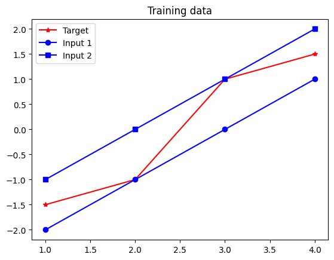

$$ Y(t) = W_o^T f_{NL}(W_i^T X(t)) $$

$$ E(t) = Y(t) - T(t) $$

$$ \text{mse} = \frac{1}{s} \sum_{k=1}^{m} \sum_{t=1}^{s} e_k^2(t) $$

$$ \Delta W_o = -\alpha \cdot \frac{2}{s} \cdot E(t) \cdot Z^T(t) $$


$$ \Delta W_i^T = -\alpha \cdot \frac{2}{s} \cdot E^T(t) \cdot W_{oj} \cdot \frac{\partial f_{NL}}{\partial Z_{in}} \cdot X^T(t) $$


$$ f_{NL}(x) = \frac{2}{1 + e^{-2x}} - 1 $$


# Building A Feedforward Neural Network

>A Feed-forward Neural Network with one hidden layer (i.e. 'output' layer)


The goal of this exercise is to build a simple **[Feedforward Neural Network](https://en.wikipedia.org/wiki/Feedforward_neural_network)**
## Theoretical Background

A feedforward neural network consists of layers of neurons where connections between the nodes do not form cycles. The simplest form includes:

- Input Layer: Receives the input features.
- Hidden Layer: Processes inputs from the input layer.
- Output Layer: Produces the final prediction.

Mathematically, a simple feedforward network with \( n \) inputs, \( m \) outputs, and a hidden layer with \( p \) neurons can be modeled as:

$$ Y(t) = W_o^T f_{NL}(W_i^T X(t)) $$

Where:
- \( X(t) \) is the input vector,
- \( W_i \) is the weight matrix for the input layer (\( n\) × \( p\)),
- \( f_{NL} \) is the non-linear activation function (e.g. Tanh, ReLU),
- \( W_o \) is the weight matrix for the output layer (\( p\) × \( m\)),
- \( Y(t) \) is the output vector

The network computes the error between the predicted output \( Y(t) \) and the actual target \( T(t) \):

$$ E(t) = Y(t) - T(t) $$

To optimize the network, we aim to minimize the **Mean Squared Error (MSE)**:

$$ \text{mse} = \frac{1}{s} \sum_{k=1}^{m} \sum_{t=1}^{s} e_k^2(t) $$

Where:
- \( s \) is the total number of samples,
- \( e_k(t) \) is the \( k \)-th component of the error vector \( E(t) \).

The network adjusts its weights using the backpropagation algorithm, which calculates the gradients of the error with respect to each weight and updates them to minimize the error.

For the output layer:

  $$ \Delta W_o = -\alpha \cdot \frac{2}{s} \cdot E(t) \cdot Z^T(t) $$

For the input layer:

  $$ \Delta W_i^T = -\alpha \cdot \frac{2}{s} \cdot E^T(t) \cdot W_{oj} \cdot \frac{\partial f_{NL}}{\partial Z_{in}} \cdot X^T(t) $$

Where:
- \( \alpha \) is the learning rate,
- \( Z(t) \) is the output of the hidden layer.

The non-linear function we will use in this exercise is the hyperbolic tangent "Tanh":

$$ f_{NL}(x) = \frac{2}{1+e^{-2x}}-1 $$

## Setup

##### Creating the Neural Network in Python

We'll start by implementing the feedforward neural network using **NumPy**, a fundamental package for scientific computing in Python.

We use Numpy because (1) array is much more efficient than lists, and (2) we can easily define the activation function such as tanh(x) with the library.

```Python
import numpy as np
```
Let's define our input and target vectors:
```Python
import numpy as np

# Define input and target vectors
x = np.array([[-2, -1, 0, 1],  # input 1
              [-1,  0, 1, 2]]) # input 2

t = np.array([-1.5, -1, 1, 1.5]) # target

# Display the inputs and corresponding targets
print(f"This network has {x.shape[1]} inputs:")

for i in range(x.shape[1]):
    print(f"    [{x[0, i]}, {x[1, i]}] with target {t[i]}")
```

Output:
```Python
This network has 4 inputs:
    [-2, -1] with target -1.5
    [-1, 0] with target -1.0
    [0, 1] with target 1.0
    [1, 2] with target 1.5
```

Next, we'll initialize the network parameters. Feel free to try varying these values to test the influence in the algorithm.

```Python
wi1=0.0651    # first weight of the input layer
wi2=-0.6970   # second weight of the input layer
wo=-0.1342    # first weight of the output layer
bi=0          # input bias
bo=-0.5481    # output bias

q=500         # training epochs
a=0.01        # learning rate
```

It is always a good practice to visualize the data distribution by plotting the input values against the targets. If certain inputs are grouped closely and share similar characteristics, it might indicate redundancy in data. It also helps us eliminate any outliers we don't want to include in our training.

To plot the input and target vectors, we will use [Matplotlib](https://matplotlib.org/stable/tutorials/pyplot.html):

```py
import matplotlib.pyplot as plt
```

```py
i=np.arange(1,5)   # np.arrange returns evenly spaced values between [s,t]
# Refer to matplotlib doc for plt functions: https://matplotlib.org/stable/tutorials/pyplot.html

plt.plot(i, t, 'r*-', label='Target') # red star marker solid line (r*-)
plt.plot(i,x[0],'bo-',label='Input 1') # blue circle marker solid line (bo-)
plt.plot(i,x[1],'bs-',label='Input 2') # blue square marker solid line (bs-)
plt.title('Training data')
plt.legend()
plt.show()
```


## Experiments


(b) Propagate the input through the network to obtain the output Y (t). Plot the network output and the target vector in the same figure to compare
them.

(c) Train the network. Once the network has been trained, plot the mean
squared error for each epoch. Use a semi-logarithmic scale at the y-axis.

(d) Once again plot the outputs and the target vector using the network
trained instead to compare the results.

(e) Introduce variations to the learning rate and number of training epochs. Observe and comment the obtained results. Some suggested tests are:
• Keep the number of epochs fixed at 500, then vary the learning rate
to α = 0.1 and α = 0.001.
• Keep the learning rate fixed at α = 0.01, then vary the number of
epochs to 50 and 1000.

(f) Vary the initial value of the weights to the following set: wi1 = 0, wi2 = 0, wo = 1, bi = 1, bo = 1. The training is highly dependent of the initial solution, why?

(g) Currently, there are libraries that simplify the process of creating and training neural networks. TensorFlow and Keras are among the most
popular ones. 
Propose a simplified version of the previous experiment using TF and Keras.

(h) Consider using Stochastic Gradient Descent (SGD) as the optimizer. What is the difference with Gradient Descent?