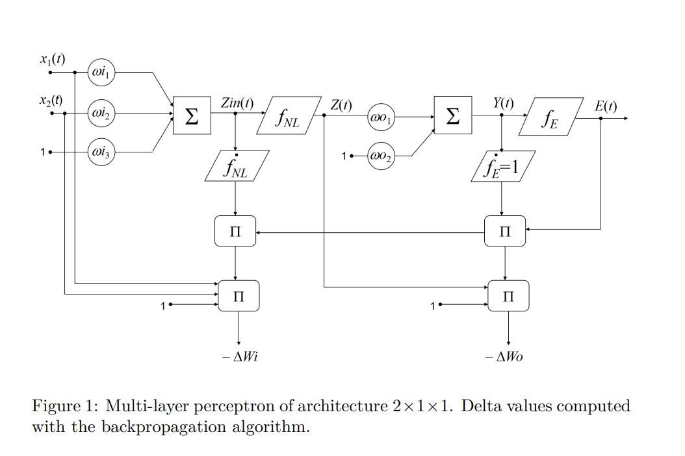

$$ Y(t) = W_o^T f_{NL}(W_i^T X(t)) $$

$$ E(t) = Y(t) - T(t) $$

$$ \text{mse} = \frac{1}{s} \sum_{k=1}^{m} \sum_{t=1}^{s} e_k^2(t) $$

$$ \Delta W_o = -\alpha \cdot \frac{2}{s} \cdot E(t) \cdot Z^T(t) $$


$$ \Delta W_i^T = -\alpha \cdot \frac{2}{s} \cdot E^T(t) \cdot W_{oj} \cdot \frac{\partial f_{NL}}{\partial Z_{in}} \cdot X^T(t) $$


$$ f_{NL}(x) = \frac{2}{1 + e^{-2x}} - 1 $$


# Building A Feedforward Neural Network

>A Feed-forward Neural Network with one hidden layer (i.e. 'output' layer)


The goal of this exercise is to build a simple **[Feedforward Neural Network](https://en.wikipedia.org/wiki/Feedforward_neural_network)**
## Theoretical Background

A **Feedforward Neural Network** consists of layers of neurons where connections between the nodes do not form cycles. The simplest form includes:

- Input Layer: Receives the input features.
- Hidden Layer: Processes inputs from the input layer.
- Output Layer: Produces the final prediction.

Mathematically, a simple feedforward network with \( n \) inputs, \( m \) outputs, and a hidden layer with \( p \) neurons can be modeled as:

$$
Y(t) = W_o^T f_{NL}(W_i^T X(t) + b_i) + b_o
$$

Where:
- \( X(t) \) is the input vector for the \( t \)-th sample.
- \( W_i \) is the weight matrix for the input layer (\( n \times p \)).
- \( b_i \) is the bias vector for the hidden layer (\( 1 \times p \)).
- \( f_{NL} \) is the non-linear activation function (e.g., Tanh, ReLU).
- \( W_o \) is the weight matrix for the output layer (\( p \times m \)).
- \( b_o \) is the bias vector for the output layer (\( 1 \times m \)).
- \( Y(t) \) is the output vector for the \( t \)-th sample.

After obtaining the output \( Y(t) \) from the output layer, The network computes the error between the predicted output \( Y(t) \) and the target \( T(t) \):

$$ E(t) = Y(t) - T(t) $$

The **Mean Squared Error (MSE)** aggregates these errors across all samples to provide a single measure of the network's performance.

<details open>
  <summary>What is <b>Mean Squared Error (MSE)</b>?</summary>
  
  **MSE** is the average of the squared differences between the predicted values and the actual target values. As the error rate increases, the MSE penalty grows quadratically, which heavily penalizes larger errors. A downside to MSE is that if applied to a dataset with a few outliers, it can heavily penalize the model.

  $$ 
  \text{MSE} = \frac{1}{s} \sum_{t=1}^{s} \sum_{k=1}^{m} (y_k(t) - \hat{y}_k(t))^2 = \frac{1}{s} \sum_{t=1}^{s} \| \mathbf{E}(t) \|^2 
  $$

  **Where:**
  - \( s \) is the total number of samples.
  - \( m \) is the number of output neurons or dimensions.
  - \( y_k(t) \) is the observed (actual) value for the \( k \)-th output in the \( t \)-th sample.
  - \( \hat{y}_k(t) \) is the predicted value for the \( k \)-th output in the \( t \)-th sample.
  - \( \mathbf{E}(t) \) is the error vector for the \( t \)-th sample, where each component \( e_k(t) = y_k(t) - \hat{y}_k(t) \).

  MSE is one of the most popular tools to measure how accurate models are within statistics and machine learning. Within ML, MSE is used as a loss function or part of a loss function that an algorithm minimizes.
  
</details>

When training a neural network, our goal is to **minimize the MSE**, meaning we want our predictions to be as close as possible to the actual targets.

To minimize the MSE, we need to adjust the network's weights in the direction that reduces the error. This is achieved through **backpropagation**, which involves computing the gradient of the MSE with respect to each weight in the network.

Backpropagation can be done by following the four steps:

1. **Compute the gradient of MSE**
The gradient of the MSE with respect to each weight in the output layer \( W_o \) is calculated to understand how changes in these weights affect the overall error. The formula for the gradient is:

   $$
   \frac{\partial \text{MSE}}{\partial W_o} = \frac{2}{s} E(t) \cdot Z^T(t)
   $$

   Where:
   - \( \frac{2}{s} \): This scaling factor comes from the derivative of the squared error term and the averaging over all samples in the MSE.
   - \( E(t) \): The error vector for the \( t \)-th sample (\( E(t) = Y(t) - T(t) \)).
   - \( Z(t) \): The activation from the hidden layer for the \( t \)-th sample.
   - \( Z^T(t) \): The transpose of \( Z(t) \), ensuring proper matrix multiplication dimensions.

2. **Update the Output Layer Weights (\( W_o \))**
Using the computed gradient, the weights are updated to minimize the MSE:

   $$
   \Delta W_o = -\alpha \cdot \frac{2}{s} E(t) \cdot Z^T(t)
   $$
  Where:
   - \( \alpha \) is the learning rate, controlling the step size of each update.

3. **Compute the Gradient of MSE with Respect to Input Layer Weights (\( W_i \)):**

   Similarly, gradients are computed for the input layer weights to adjust them accordingly:

   $$
   \Delta W_i^T = -\alpha \cdot \frac{2}{s} E^T(t) \cdot W_o \cdot \frac{\partial f_{NL}}{\partial Z_{in}} \cdot X^T(t)
   $$

   Where:
   - \( E^T(t) \): The transpose of the error vector.
   - \( W_o \): The weight matrix of the output layer.
   - \( \frac{\partial f_{NL}}{\partial Z_{in}} \): The derivative of the non-linear activation function (Tanh) with respect to the input of the hidden layer.
   - \( X^T(t) \): The transpose of the input vector for the \( t \)-th sample.

4. **Update the Input Layer Weights (\( W_i \)):**

   Using the computed gradient, the input layer weights are updated*:

   $$
   W_i = W_i + \Delta W_i
   $$
   *( = is assignment here)


The non-linear function we will use in this exercise is the hyperbolic tangent "Tanh":

$$ f_{NL}(x) = \frac{2}{1+e^{-2x}}-1 $$

## Setup

##### Creating the Neural Network in Python

We'll start by implementing the feedforward neural network using **NumPy**, a fundamental package for scientific computing in Python.

We use Numpy because (1) array is much more efficient than lists, and (2) we can easily define the activation function such as tanh(x) with the library.

```Python
import numpy as np
```
Let's define our input and target vectors:
```Python
import numpy as np

# Define input and target vectors
x = np.array([[-2, -1, 0, 1],  # input 1
              [-1,  0, 1, 2]]) # input 2

t = np.array([-1.5, -1, 1, 1.5]) # target

# Display the inputs and corresponding targets
print(f"This network has {x.shape[1]} inputs:")

for i in range(x.shape[1]):
    print(f"    [{x[0, i]}, {x[1, i]}] with target {t[i]}")
```

Output:
```Python
This network has 4 inputs:
    [-2, -1] with target -1.5
    [-1, 0] with target -1.0
    [0, 1] with target 1.0
    [1, 2] with target 1.5
```

Next, we'll initialize the network parameters. Feel free to try varying these values to test the influence in the algorithm.

```Python
wi1=0.0651    # first weight of the input layer
wi2=-0.6970   # second weight of the input layer
wo=-0.1342    # first weight of the output layer
bi=0          # input bias
bo=-0.5481    # output bias

q=500         # training epochs
a=0.01        # learning rate
```

It is always a good practice to visualize the data distribution by plotting the input values against the targets. If certain inputs are grouped closely and share similar characteristics, it might indicate redundancy in data. It also helps us eliminate any outliers we don't want to include in our training.

To plot the input and target vectors, we will use [Matplotlib](https://matplotlib.org/stable/tutorials/pyplot.html):

```py
import matplotlib.pyplot as plt
```

```py
i=np.arange(1,s+1)   # x axis for plotting (1 to 4)
# Refer to matplotlib doc for plt functions: https://matplotlib.org/stable/tutorials/pyplot.html

plt.plot(i, t, 'r*-', label='Target') # red star marker solid line (r*-)
plt.plot(i,x[0],'bo-',label='Input 1') # blue circle marker solid line (bo-)
plt.plot(i,x[1],'bs-',label='Input 2') # blue square marker solid line (bs-)
plt.title('Training data')
plt.legend()
plt.show()
```


## Experiments

Now it's time to propagate the input through the network.

First, we'll pass input data through each layer of the network, applying weights and bias at each neuron. 

Recap of the figure:
> 


```py
# initialize temp variables for forward propagation
s = x.shape[1]     # number of samples (data points, 4 here)
zini = np.zeros(s) # zin for each data point
zi = np.zeros(s)   # zi for each data point
yi = np.zeros(s)   # output without training

# forward propagation
for k in range(s):
  x0_k = x[0, k]   # kth data point of 1st input
  x1_k = x[1, k]   # kth data point of 2nd input  
  zini[k] = (wi1 * x0_k + wi2 * x1_k) + bi
```


Then, we'll transform the data using the activation function *tanh* and apply the output weight and bias to optain the final output.


```py
# forward propagation
for k in range(s):
  x0_k = x[0, k]   # kth data point of 1st input
  x1_k = x[1, k]   # kth data point of 2nd input
  zini[k] = (wi1 * x0_k + wi2 * x1_k) + bi
  zi[k] = (2/(1+np.exp(-2*zini[k])))-1
  yi[k] = zi[k] * wo + bo
```

Now we can plot this output using `plt.plot` as before:
```py
plt.plot(i,t,'r*-',label='Target')
plt.plot(i,yi,'k+-',label='Output')
plt.title('Network output without training')
plt.legend()
plt.show()
```


 As you can see, the output prediction of our untrained neural network (black line) deviates from the target vector (red). Let's start training the network for 500 epochs with 0.01 learning rate and monitor the MSE (Mean Squared Error) over time.

First, we'll initialize the variables for the MSE and errors:
```py
 mse = np.zeros(q) # MSE for each epoch
 e = np.zeros(q)   # Error for each epoch
```

The first part of the training will involve computing the output of the network, which we have done above already.
```py
for ep in range(q): # for each epoch 
  for k in range(s): # for every data point
    # 1. Compute the output of the network
    # 2. Compute the error
    # 3. Backpropagate
```

So we will simply copy and paste from above. (Note we should reset the variables at the start of each epoch)
```py
for ep in range(q): # for each epoch 
  zini = np.zeros(s) # zin for each data point
  zi = np.zeros(s)   # zi for each data point
  yi = np.zeros(s)   # output without training

  for k in range(s): # for every data point
    # 1. Compute the output of the network      
    zini[k] = (wi1 * x0_k + wi2 * x1_k) + bi
    zi[k] = (2/(1+np.exp(-2*zini[k])))-1
    yi[k] = zi[k] * wo + bo

    # 2. Compute the error
    # 3. Backpropagate
```
Then, we will set the error and the MSE. Here is a quick recap of the definition of error:

> The network computes the error between the predicted output \( Y(t) \) and the actual target \( T(t) \):
$$ E(t) = Y(t) - T(t) $$


```py
for ep in range(q): # for each epoch 
  zini = np.zeros(s) # zin for each data point
  zi = np.zeros(s)   # zi for each data point
  yi = np.zeros(s)   # output without training
  
  for k in range(s): # for every data point
    # 1. Compute the output of the network      
    zini[k] = (wi1 * x0_k + wi2 * x1_k) + bi
    zi[k] = (2/(1+np.exp(-2*zini[k])))-1
    yi[k] = zi[k] * wo + bo


    # 2. Compute the error
    e[k] = yi[k] - t[k]

    # 3. Backpropagate
```

And we'll follow the formula for MSE. A quick recap of the definition:

> To optimize the network, we aim to minimize the **Mean Squared Error (MSE)**:
> $$ \text{mse} = \frac{1}{s} \sum_{k=1}^{m} \sum_{t=1}^{s} e_k^2(t) $$
> Where: 
> - \( s \) is the total number of samples,
> - \( e_k(t) \) is the \( k \)-th component of the error vector \( E(t) \).


```py
for ep in range(q): # for each epoch 
  zini = np.zeros(s) # zin for each data point
  zi = np.zeros(s)   # zi for each data point
  yi = np.zeros(s)   # output without training
  
  for k in range(s): # for every data point
    # 1. Compute the output of the network      
    zini[k] = (wi1 * x0_k + wi2 * x1_k) + bi
    zi[k] = (2/(1+np.exp(-2*zini[k])))-1
    yi[k] = zi[k] * wo + bo


    # 2. Compute the error
    e[k] = yi[k] - t[k]
    mse[ep] = mse[ep] + (1.0/s)*np.power(e[k],2)

    # 3. Backpropagate
```


We are now ready to backpropagate. Let's start with the output layer:

  $$ \Delta W_o = -\alpha \cdot \frac{2}{s} \cdot E(t) \cdot Z^T(t) $$

Where:
- \( \alpha \) is the learning rate,
- \( Z(t) \) is the output of the hidden layer.
- The factor \( \frac{2}{s} \)​ is derived from the MSE function


 The key part of this stage is calculating the gradients of the error with respect to the weights and biases to adjust them. Specifically:

- The gradients \( ΔW_o \) and \( ​Δb_o \) are calculated for the weights and bias of the output layer using the error term \( e_k \) and the learning rate \( a \), and the hidden layer output \( z_k \).
- These gradients are accumulated across all data points to reflect how much each weight and bias contributed to the overall error.
- The calculated gradients will then be used to update the weights and biases, with the goal of reducing the error in the next epoch.


The variables for backpropagation will also need to be reset for every epoch:

```py
for ep in range(q): # for each epoch 
  zini = np.zeros(s) # zin for each data point
  zi = np.zeros(s)   # zi for each data point
  yi = np.zeros(s)   # output without training
  dEdbo = dEdwo = dEdbi = dEdwi1 = dEdwi2 = 0 # delta variables for backpropagation

  for k in range(s): # for every data point
    # 1. Compute the output of the network      
    zini[k] = (wi1 * x0_k + wi2 * x1_k) + bi
    zi[k] = (2/(1+np.exp(-2*zini[k])))-1
    yi[k] = zi[k] * wo + bo


    # 2. Compute the error
    e[k] = yi[k] - t[k]
    mse[ep] = mse[ep] + (1.0/s)*np.power(e[k],2)

    # 3. Backpropagate
    dEdbo=dEdbo+alfa*(2.0/s)*e[k] # delta 
    dEdwo=dEdwo+alfa*(2.0/s)*e[k]*z[k]
```


And for the input layer:

  $$ \Delta W_i^T = -\alpha \cdot \frac{2}{s} \cdot E^T(t) \cdot W_{oj} \cdot \frac{\partial f_{NL}}{\partial Z_{in}} \cdot X^T(t) $$


```py
for ep in range(q): # for each epoch 
  ...
  for k in range(s): # for every data point
    ...
    # 3. Backpropagate
    # Computing delta values (gradients) for the output layer
    dEdbo=dEdbo+a*(2.0/s)*e[k]
    dEdwo=dEdwo+a*(2.0/s)*e[k]*z[k]

    #Computing delta values (gradients) for the hidden layer (using the derivative of the non-linear function)
    dEdbi=dEdbi

    dEdbi=dEdbi+a*(2.0/s)*e[k]*wo*(s*np.exp(-2*zin[k])/np.power(1+np.exp(-2*zin[k]),2))
    dEdwi1=dEdwi1+a*(2.0/s)*e[k]*wo*(s*np.exp(-2*zin[k])/(np.power(1+np.exp(-2*zin[k]),2)))*x[0,k]
    dEdwi2=dEdwi2+a*(2.0/s)*e[k]*wo*(s*np.exp(-2*zin[k])/(np.power(1+np.exp(-2*zin[k]),2)))*x[1,k]
```

(e) Introduce variations to the learning rate and number of training epochs. Observe and comment the obtained results. Some suggested tests are:
• Keep the number of epochs fixed at 500, then vary the learning rate
to α = 0.1 and α = 0.001.
• Keep the learning rate fixed at α = 0.01, then vary the number of
epochs to 50 and 1000.

(f) Vary the initial value of the weights to the following set: wi1 = 0, wi2 = 0, wo = 1, bi = 1, bo = 1. The training is highly dependent of the initial solution, why?

(g) Currently, there are libraries that simplify the process of creating and training neural networks. TensorFlow and Keras are among the most
popular ones. 
Propose a simplified version of the previous experiment using TF and Keras.

(h) Consider using Stochastic Gradient Descent (SGD) as the optimizer. What is the difference with Gradient Descent?